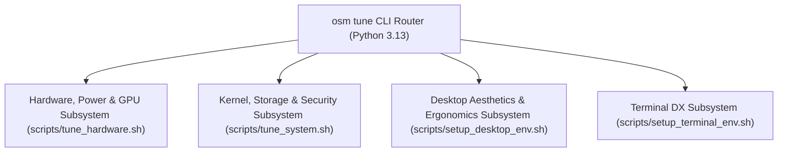

# CHECKPOINT HANDOFF: Debian 13 (Trixie) Desktop & Hardware Customization Specification & Plan

**Status:** APPROVED & READY FOR IMPLEMENTATION  
**Timestamp:** 2026-08-22 10:24 WIB  
**Git HEAD:** `83c8783`  
**Design Specification:** [`docs/superpowers/specs/2026-08-22-debian-13-desktop-and-hardware-customization-design.md`](file:///home/rizz/dev/os-manager/docs/superpowers/specs/2026-08-22-debian-13-desktop-and-hardware-customization-design.md)  
**Implementation Plan:** [`docs/superpowers/plans/2026-08-22-debian-13-desktop-and-hardware-customization.md`](file:///home/rizz/dev/os-manager/docs/superpowers/plans/2026-08-22-debian-13-desktop-and-hardware-customization.md)  
**Target Environment:** Bare-Metal Debian GNU/Linux 13 (Trixie), Linux Kernel 6.12+, GNOME 48 (Wayland), Lenovo IdeaPad 3 (81WD) with Intel Ice Lake (i5-1035G1) + NVIDIA GeForce MX330  

---

## 1. Executive Summary & Architecture Overview

Following extensive brainstorming, community deep research, and architectural refinement, the full specification and test-driven implementation plan for the **Debian 13 Desktop & Hardware Customization Suite** have been approved and committed.

The system establishes a unified CLI control plane (`osm tune`) governing 4 modular subsystems:

| Subsystem | Scope & Delivered Features | Target Scripts & Test Suites |
| :--- | :--- | :--- |
| **1. Hardware Power, Thermals & Hybrid GPU** | • Lenovo Battery Conservation Mode (60% charging limit via `conservation_mode`) • Lenovo Platform Profiles (`Fn+Q` / `low-power`, `balanced`, `performance`) • Lenovo Fn-Lock toggle control (`fn_lock`) • Intel Ice Lake proactive thermal management (`thermald` + `intel_pstate` EPP) • NVIDIA GeForce MX330 PCIe Runtime D3 Cold power gating (`suspended` / 0W idle draw) • Intel Iris Plus VA-API hardware video decoding acceleration • Boot persistence systemd unit (`osm-hardware-tune.service`) | • `scripts/tune_hardware.sh` • `tests/test_tune_hardware.py` |
| **2. Kernel Sysctl, Storage, Audio & Security** | • Kernel performance sysctl tuning (`vm.swappiness=10`, `vm.vfs_cache_pressure=50`, `fs.inotify.max_user_watches=524288`, `TCP BBR`) • NVMe SSD maintenance via weekly asynchronous TRIM (`fstrim.timer`) • PipeWire & Bluetooth high-bitrate audio codecs (`wireplumber`, `SBC-XQ`, `LDAC`) • Host security & firewall hardening (`ufw` default deny in, allow out, SSH rule) • Modern APT package manager (`nala`) | • `scripts/tune_system.sh` • `tests/test_tune_system.py` |
| **3. GNOME 48 Aesthetics, Ergonomics & Dconf State** | • Inter & JetBrains Mono typography with subpixel antialiasing & hinting • Window controls (minimize/maximize/close), *center-new-windows*, mode gelap penuh (`prefer-dark`), dan *Night Light* otomatis • Touchpad gestures (`tap-to-click`, `natural-scroll`, `disable-while-typing`) & Audio Boost hingga 150% • Nautilus list-view, format tanggal detail, dan integrasi *Open in Terminal* • Persistent `/mnt/data Data Store` GTK bookmarks • Declarative Dconf profile export/import (`osm tune desktop backup/restore`) | • `scripts/setup_desktop_env.sh` • `tests/test_desktop_customization.py` |
| **4. Modern Terminal & Ultimate Developer Experience (DX)** | • Modern Rust/Go CLI Suite (`ripgrep`, `fd`, `bat`, `eza`, `fzf`, `zoxide`, `btop`, `duf`, `tmux`) • Starship prompt engine with Git status, Python venv, execution duration (> 2s) • FZF live syntax previews with `bat` & `eza --tree` • Bash 5.2+ sensible defaults & infinite timestamped history (100.000 lines) • Git power shortcuts (`gst`, `gdiff`, `glog`, `gco`, `gbr`, `gadd`, `gcm`) • Preconfigured `tmux` developer starter profile | • `scripts/setup_terminal_env.sh` • `tests/test_terminal_customization.py` |
| **5. CLI Router, Harness & Documentation** | • Unified CLI router `osm tune` supporting JSON telemetry • Master test harness integration (`tests/test_harness.sh`, `scripts/harness_check.sh`) • Comprehensive user guide (`docs/DEBIAN_13_CUSTOMIZATION_GUIDE.md`) | • `os_manager/commands/tune.py` • `os_manager/cli.py` • `tests/test_harness.sh` • `docs/DEBIAN_13_CUSTOMIZATION_GUIDE.md` |

---

## 2. Invariants & Safety Guardrails Enforced

1. **INV-01 (Zero Data Loss on `/mnt/data`):** No partition, format, or unmount operations touch `/dev/nvme0n1p4`.
2. **INV-02 (Strict Idempotency):** All shell subroutines must be safely re-runnable without duplicating configuration entries.
3. **INV-03 (Root vs User Boundary):** Package managers (`apt-get`), daemon management (`systemd`), and sysfs/sysctl writes require root/sudo; dotfiles and user configurations (`~/.config/*`, `~/.bashrc`, `~/.tmux.conf`) remain owned by non-root user.
4. **INV-04 (Hybrid GPU Decoupling):** Wayland session is driven exclusively by Intel Iris Plus Graphics (`i915`), while NVIDIA MX330 remains power-gated in Runtime D3 Cold (`suspended`) when idle.
5. **INV-05 (Offline/Fallback Resilience):** Non-graphical, containerized, and non-Lenovo hardware gracefully degrade with informative warnings rather than hard crashes.

---

## 3. Next Execution Steps

The implementation plan is ready to execute task-by-task:
* Recommended Method: `superpowers:subagent-driven-development`
* Alternative Method: `superpowers:executing-plans`

Execute Tasks 1 through 5 in order as defined in [`docs/superpowers/plans/2026-08-22-debian-13-desktop-and-hardware-customization.md`](file:///home/rizz/dev/os-manager/docs/superpowers/plans/2026-08-22-debian-13-desktop-and-hardware-customization.md).
