# Panduan Kustomisasi & Optimalisasi Bare-Metal Debian 13 (Trixie)

Dokumen ini merupakan panduan teknis komprehensif, arsitektur sistem, dan katalog perintah operasional untuk suite kustomisasi perangkat keras, kernel, desktop GNOME 48, dan antarmuka terminal developer pada lingkungan **Debian 13 (Trixie) Bare-Metal** menggunakan modul terpadu `osm tune` dan skrip pendukung di direktori `scripts/`.

---

## 1. Arsitektur & Guardrail Keandalan (SRE Invariants)

Suite optimalisasi `osm tune` dirancang untuk mentransformasi instalasi dasar Debian 13 menjadi *developer workstation* berperforma tinggi dengan efisiensi daya optimal pada perangkat Lenovo IdeaPad (Intel Core i5-1035G1 Ice Lake + NVIDIA GeForce MX330).

```mermaid
flowchart TD
    CLI["osm tune [subcommand]"] --> HW["Hardware & ACPI Layer"]
    CLI --> SYS["Kernel & Security Layer"]
    CLI --> DSK["GNOME 48 Desktop Layer"]
    CLI --> TRM["Terminal Developer Layer"]

    HW --> BAT["Battery Conservation (60% Threshold)"]
    HW --> PROF["ACPI Platform Profile (Quiet/Balanced/Perf)"]
    HW --> FN["Fn-Lock Sysfs Persistence"]
    HW --> GPU["Hybrid GPU Runtime D3 (0W Autosuspend)"]
    HW --> VA["Intel VA-API Hardware Acceleration"]
    HW --> THERM["Intel thermald Active Management"]

    SYS --> SYSCTL["Sysctl Tuning (swappiness=10, BBR, inotify)"]
    SYS --> TRIM["NVMe Weekly fstrim.timer"]
    SYS --> AUD["PipeWire & WirePlumber Stack"]
    SYS --> UFW["UFW Firewall (Default Deny In)"]

    DSK --> FONT["Inter & JetBrains Mono Typography"]
    DSK --> ERGO["Window Buttons (Standard / macOS Left Traffic Lights)"]
    DSK --> DOCK["Centered Bottom Dock (Dash-to-Dock Preset)"]
    DSK --> GTK["Nautilus Bookmarks (/mnt/data Data Store)"]
    DSK --> DCONF["Dconf State Dump & Restore"]

    TRM --> STAR["Starship Prompt Theme"]
    TRM --> TMUX["Tmux 256color & Vi-Mode Config"]
    TRM --> BASH["Bash History, Aliases & FZF Previews"]
```



### Prinsip Keamanan & Desain (Invariants):

1. **INV-01 (Zero Data Loss on `/mnt/data`):**
   * Direktori persistent data storage (`/dev/nvme0n1p4`) di `/mnt/data` tidak pernah dimodifikasi secara destruktif. Bookmark Nautilus langsung merujuk ke mount point ini.
2. **INV-02 (Strict Idempotency):**
   * Semua operasi (injeksi `~/.bashrc`, penambahan bookmark GTK, penulisan sysctl, konfigurasi systemd) bersifat idempoten dan aman dijalankan berulang kali tanpa membuat duplikasi baris atau state konflik.
3. **INV-03 (Root vs User Boundary Separation):**
   * Pemisahan tegas antara operasi tingkat sistem (yang membutuhkan eskalasi `sudo` seperti sysfs ACPI, `sysctl`, UFW, systemd) dan konfigurasi user-space (`gsettings`, `dconf`, `~/.config/starship.toml`, `~/.tmux.conf`, `~/.bashrc`).
4. **INV-04 (Hybrid GPU & Wayland Decoupling):**
   * Pengelolaan daya dGPU NVIDIA MX330 menggunakan kernel PCI Runtime Power Management (`control=auto`, Runtime D3 Cold) tanpa mengganggu sesi tampilan Wayland pada Intel Iris Plus iGPU.
5. **INV-05 (Offline & Fallback Resilience):**
   * Semua modul audit dan parsing aman dijalankan di lingkungan minimal atau WSL2 tanpa menghasilkan *uncaught exception* jika sysfs node atau biner utilitas belum terpasang.

---

## 2. Lapisan Perangkat Keras & ACPI (Hardware Tuning)

Modul hardware mengendalikan parameter fisik Lenovo IdeaPad melalui antarmuka sysfs Linux:

| Komponen / Fitur | Path Sysfs / Konfigurasi | Deskripsi & Nilai Target |
|---|---|---|
| **Battery Conservation** | `/sys/bus/platform/drivers/ideapad_acpi/VPC2004:00/conservation_mode` | Membatasi pengisian baterai pada batas aman ~60% untuk memperpanjang usia baterai saat terhubung AC (`1` = On, `0` = Off). |
| **Platform Profile** | `/sys/firmware/acpi/platform_profile` | Profil performa ACPI: `low-power` (quiet), `balanced`, atau `performance`. |
| **Lenovo Fn-Lock** | `/sys/bus/platform/drivers/ideapad_acpi/VPC2004:00/fn_lock` | Mengontrol mode tombol fungsi utama F1-F12 vs hotkey multimedia (`1` = On, `0` = Off). |
| **dGPU Power Gating** | `/sys/bus/pci/devices/0000:01:00.0/power/control` | Mengatur mode PCI runtime PM ke `auto` agar NVIDIA GPU otomatis suspend (Runtime D3 Cold, 0W idle draw) saat tidak digunakan. |
| **Intel VA-API Video Accel** | Driver `intel-media-va-driver-non-free` | Akselerasi decoding hardware video H.264/HEVC/VP9 pada Intel Ice Lake Iris Plus Graphics. |
| **Intel thermald** | Daemon `thermald.service` | Daemon pencegah *thermal throttling* ekstrim dan pengaturan kipas pendingin dinamis. |
| **Boot Persistence** | `/etc/systemd/system/osm-hardware-tune.service` | Unit oneshot systemd untuk memulihkan konfigurasi ACPI & GPU secara otomatis saat boot. |

### Unit Boot Persistence (`osm-hardware-tune.service`):

Konfigurasi disimpan di `/etc/osm/hardware-tune.conf`:
```ini
CONSERVATION_MODE=1
PLATFORM_PROFILE=balanced
FN_LOCK=1
GPU_POWER_SAVE=auto
```

---

## 3. Lapisan Kernel, Storage & Keamanan (System Tuning)

### 3.1 Kernel Sysctl (`/etc/sysctl.d/99-osm-performance.conf`)

Optimalisasi kernel Linux untuk responsivitas memori, inotify watch agent AI, dan throughput jaringan:

```ini
# os-manager Debian 13 Kernel Performance Tuning
vm.swappiness = 10
vm.vfs_cache_pressure = 50
fs.inotify.max_user_watches = 524288
fs.inotify.max_user_instances = 1024
vm.dirty_background_ratio = 5
vm.dirty_ratio = 10
net.core.default_qdisc = fq
net.ipv4.tcp_congestion_control = bbr
```

* **`vm.swappiness = 10` & `vm.vfs_cache_pressure = 50`**: Mencegah kernel melakukan *aggressive swapping* saat RAM masih cukup, serta mempertahankan cache VFS (inode/dentry) untuk kecepatan I/O git dan file traversing.
* **`fs.inotify.max_user_watches = 524288`**: Menjamin tools developer (VSCode, Vite, Next.js, Claude Code, Antigravity) tidak mengalami error `ENOSPC: System limit for number of file watchers reached`.
* **`tcp_congestion_control = bbr` + `default_qdisc = fq`**: Mengaktifkan algoritma Google BBR TCP Congestion Control untuk latensi jaringan minimal dan bandwidth maksimal.

### 3.2 NVMe Storage & Keamanan Jaringan

* **NVMe TRIM**: Mengaktifkan `fstrim.timer` untuk eksekusi TRIM mingguan pada SSD NVMe (`/dev/nvme0n1`), mencegah degradasi kecepatan tulis jangka panjang.
* **UFW Firewall**: Mengonfigurasi firewall host dengan kebijakan default *deny incoming* dan *allow outgoing*.
* **PipeWire Audio Stack**: Mengaudit ketersediaan server audio modern PipeWire dan session manager WirePlumber untuk latensi audio rendah dan kompatibilitas Bluetooth codec LDAC/AAC.

---

## 4. Lapisan Desktop GNOME 48 & Ergonomi

Kustomisasi tampilan dan workflow desktop dioptimalkan untuk produktivitas developer:

### 4.1 Tipografi & Tampilan

* **Interface Font**: `Inter 10.5`
* **Document Font**: `Inter 11`
* **Monospace Font**: `JetBrains Mono 10`
* **Font Rendering**: Antialiasing `rgba` (subpixel), Hinting `slight`
* **Tema Warna**: `prefer-dark` (Dark mode global) & `night-light-enabled` (filter cahaya biru adaptif)

### 4.2 Manajemen Jendela & Ergonomi Input

* **Window Controls**: Tombol Minimize, Maximize, dan Close di sisi kanan (`appmenu:minimize,maximize,close`).
* **Center New Windows**: Menempatkan jendela baru di tengah layar (`center-new-windows: true`).
* **Alt+Tab Switching**: Mengalihkan langsung antar jendela spesifik (`switch-windows = ['<Alt>Tab']`), bukan antar grup aplikasi.
* **Touchpad**: `tap-to-click = true`, `natural-scroll = true`, `disable-while-typing = true`.
* **Audio Over-Amplification**: Mengizinkan volume melebihi 100% saat diperlukan (`allow-volume-above-100-percent: true`).

### 4.3 Nautilus & Integrasi Penyimpanan Data

* **Default Folder View**: List View (`list-view`) dengan format tanggal detail (`detailed`).
* **GTK Bookmark Otomatis**: Menambahkan `file:///mnt/data Data Store` ke file `~/.config/gtk-3.0/bookmarks` sehingga partisi data persistent selalu muncul di sidebar file manager Nautilus.
* **Dconf Backup / Restore**: Menyediakan backup deklaratif status konfigurasi GNOME ke `~/.config/dconf/gnome-desktop.ini`.

### 4.4 Suite Transformasi Desktop macOS Ver 3.0

Suite transformasi `macos` (`osm tune desktop --preset macos-full` atau `bash scripts/setup_desktop_env.sh --preset macos-full`) mentransformasi antarmuka GNOME 48 menjadi layout terinspirasi macOS yang elegan, modern, dan ergonomis:

* **Preset Tersedia**:
  * `macos-full` (alias: `macos`): Transformasi menyeluruh yang mengintegrasikan tema WhiteSur (GTK, Icon, Cursor), Apple SF Pro & SF Mono typography, konfigurasi floating bottom dock (`dash-to-dock`), efek transparansi panel (`blur-my-shell`), dan animasi jendela (`magic-lamp`).
  * `macos-core`: Transformasi esensial visual macOS (tombol window traffic lights kiri, floating centered dock, SF fonts) tanpa efek animasi berat.
  * `standard`: Konfigurasi standar GNOME 48 dengan tombol jendela di sebelah kanan dan font Inter / JetBrains Mono.
* **Fitur & Tata Letak Visual**:
  * **Tombol Jendela Kiri (Traffic Lights)**: Tombol Close, Minimize, dan Maximize diletakkan di sudut kiri atas jendela (`org.gnome.desktop.wm.preferences button-layout 'close,minimize,maximize:'`).
  * **Centered Bottom Dock (`dash-to-dock`)**:
    * Posisi dock di bawah layar (`dock-position = 'BOTTOM'`)
    * Dock terpusat / ukuran dinamis tanpa bar layar penuh (`extend-height = false`)
    * Ukuran ikon dock 48px (`dash-max-icon-size = 48`)
    * Mode cerdas Autohide & Intellihide (`autohide = true`, `intellihide = true`, `dock-fixed = false`)
    * Dock shrink theme adaptif (`custom-theme-shrink = true`)
    * Kebersihan visual: Sembunyikan ikon trash dan mounted storage (`show-trash-icon = false`, `show-mounts = false`)
  * **Tipografi Apple SF Pro & SF Mono**: Antarmuka menggunakan `SF Pro Text 10.5`, dokumen `SF Pro Text 11`, monospace terminal `SF Mono 10`, dan titlebar `SF Pro Display Bold 10.5` dengan fontconfig subpixel antialiasing `rgba` dan hinting `slight` (dengan fallback otomatis ke `Inter` & `JetBrains Mono`).
  * **Mode Warna & Variasi Aksen**:
    * Opsi `--mode dark` (default) atau `--mode light` untuk tema GTK, ikon, dan preferensi skema warna.
    * Opsi `--accent [default|blue|purple|pink|red|orange|yellow|green|grey]` untuk kustomisasi warna aksen WhiteSur.
  * **Simulasi Tanpa Efek Samping (`--dry-run`)**: Memvalidasi seluruh pipeline rencana instalasi dan matriks gsettings tanpa mengubah sistem.

### 4.5 Sistem Snapshot & Rollback Otomatis

Untuk menjamin keandalan dan mencegah rusaknya konfigurasi desktop pengguna:
* **Lokasi Snapshot**: Seluruh backup dconf otomatis disimpan di direktori `~/.config/osm/backups/` dengan penamaan `desktop-YYYYMMDD-HHMMSS.dconf`.
* **Automated Safety Net**: Setiap pemanggilan `osm tune desktop --preset ...` atau `setup_desktop_env.sh --preset ...` secara otomatis membuat snapshot konfigurasi GNOME sebelum modifikasi diterapkan.
* **Manual Backup & Restore**:
  * Backup manual: `osm tune desktop backup` (atau `--file /path/to/backup.dconf`)
  * Rollback instan: `osm tune desktop restore` secara otomatis mencari snapshot terbaru di `~/.config/osm/backups/` dan memulihkan seluruh state GNOME dconf secara instan.
  * Rollback dari file spesifik: `osm tune desktop restore --file /path/to/backup.dconf`


---

## 5. Lapisan Developer Experience & Terminal Power-Up

### 5.1 Starship Prompt (`~/.config/starship.toml`)

Prompt modern berbasis Rust yang responsif dan memuat konteks git, runtime versi (Python, Node, Rust, Docker), durasi eksekusi perintah, dan status exit code:

```toml
add_newline = false

format = """
$directory\
$git_branch\
$git_status\
$python\
$nodejs\
$rust\
$docker_context\
$cmd_duration\
$line_break\
$character"""

[directory]
truncation_length = 3
truncate_to_repo = true
style = "bold cyan"

[git_branch]
style = "bold purple"

[git_status]
style = "bold red"

[cmd_duration]
min_time = 2_000
style = "bold yellow"

[python]
style = "bold yellow"

[character]
success_symbol = "[❯](bold green)"
error_symbol = "[❯](bold red)"
```

### 5.2 Tmux Developer Starter Profile (`~/.tmux.conf`)

* Dukungan mouse penuh (klik, resize pane, scroll selection).
* Warna TrueColor 256 (`xterm-256color` + Tc overrides).
* Navigasi buffer copy mode menggunakan vi-keys (`mode-keys vi`).
* Shortcut split jendela yang intuitif (`|` horizontal split, `-` vertical split) dengan retensi path direktori aktif (`pane_current_path`).

### 5.3 Bash Power-Up Hooks & Modern CLI Toolchain

Blok idempoten terinjeksi ke `~/.bashrc`:
* **Sanitasi History**: `HISTSIZE=100000`, `HISTFILESIZE=200000`, `HISTCONTROL=ignoreboth:erasedups`, timestamp ISO format.
* **Modern CLI Aliases**:
  * `ls` / `ll` / `la` / `lt` $\rightarrow$ `eza` (dengan ikon dan git status)
  * `cat` $\rightarrow$ `bat --paging=never`
  * `grep` $\rightarrow$ `rg` (ripgrep)
  * `find` $\rightarrow$ `fd`
  * `df` $\rightarrow$ `duf`
  * `top` $\rightarrow$ `btop`
  * `cd` $\rightarrow$ `z` (zoxide smart jumping)
* **Git Aliases**: `gst`, `gdiff`, `glog`, `gco`, `gbr`, `gadd`, `gcm`.
* **FZF Live Interactive Previews**:
  * `Ctrl+T`: Pencarian file interaktif dengan live syntax preview via `bat`.
  * `Alt+C`: Navigasi direktori interaktif dengan preview tree via `eza`.
  * `Ctrl+R`: Riwayat perintah fuzzy search dengan word-wrap.

---

## 6. Katalog Perintah CLI (`osm tune`)

Perintah terpadu `osm tune` dapat diakses langsung dari terminal:

```bash
# ----------------------------------------------------
# 1. AUDIT & DIAGNOSTIK MENYELURUH
# ----------------------------------------------------
osm tune audit                # Menampilkan laporan status hardware, GPU, VA-API, sysctl, TRIM
osm tune                      # Menampilkan menu bantuan dan daftar subcommand

# ----------------------------------------------------
# 2. HARDWARE & POWER MANAGEMENT
# ----------------------------------------------------
osm tune battery status       # Memeriksa status Lenovo Conservation Mode (enabled/disabled/unsupported)
osm tune battery on           # Mengaktifkan mode konservasi baterai (threshold 60%)
osm tune battery off          # Menonaktifkan mode konservasi baterai (pengisian penuh 100%)

osm tune profile status       # Memeriksa profil ACPI (low-power/balanced/performance)
osm tune profile quiet        # Mengatur profil ke mode hening (low-power)
osm tune profile balanced     # Mengatur profil ke mode standar (balanced)
osm tune profile performance  # Mengatur profil ke performa maksimal

osm tune fn-lock status       # Memeriksa status Fn-Lock
osm tune fn-lock on           # Mengunci tombol F1-F12 sebagai fungsi utama
osm tune fn-lock off          # Mengatur tombol F1-F12 sebagai hotkey multimedia

osm tune gpu status           # Memeriksa status runtime power gating NVIDIA dGPU (Runtime D3)
osm tune gpu power-save       # Menegakkan mode autosuspend (control=auto) pada NVIDIA GPU

osm tune vaapi status         # Memeriksa status akselerasi video Intel VA-API
osm tune vaapi install        # Menginstal driver non-free Intel VA-API dan paket vainfo

osm tune hardware-persist status   # Memeriksa status systemd persistence service
osm tune hardware-persist enable   # Mengaktifkan autostart boot persistence
osm tune hardware-persist apply    # Mengaplikasikan nilai dari /etc/osm/hardware-tune.conf

# ----------------------------------------------------
# 3. KERNEL & SYSTEM TUNING
# ----------------------------------------------------
osm tune system audit         # Memeriksa nilai sysctl (swappiness, inotify, BBR) & fstrim.timer
osm tune system apply         # Menerapkan konfigurasi sysctl kernel performa tinggi

# ----------------------------------------------------
# 4. DESKTOP GNOME 48 & MACOS TRANSFORMATION
# ----------------------------------------------------
osm tune desktop audit                    # Memeriksa daftar bookmark GTK Nautilus
osm tune desktop apply                    # Menerapkan preset standar (tombol kanan, tipografi, bookmark)
osm tune desktop --preset standard        # Menerapkan preset GNOME standar
osm tune desktop --preset macos-full      # Transformasi penuh macOS (WhiteSur GTK/icons/cursors, SF fonts, Blur, Magic Lamp, Dock)
osm tune desktop --preset macos-core      # Kustomisasi inti macOS (tombol kiri traffic lights, centered bottom dock, SF fonts)
osm tune desktop --preset macos-full --mode dark --accent blue  # Kustomisasi preset dengan mode dan aksen warna spesifik
osm tune desktop --preset macos-full --dry-run                  # Simulasi eksekusi transformasi tanpa modifikasi sistem
osm tune desktop backup                   # Membuat snapshot dconf otomatis ke ~/.config/osm/backups/desktop-<timestamp>.dconf
osm tune desktop backup --file /tmp/backup.dconf  # Ekspor dconf settings ke file spesifik
osm tune desktop restore                  # Memulihkan konfigurasi desktop dari snapshot terbaru di ~/.config/osm/backups/
osm tune desktop restore --file /tmp/backup.dconf # Memulihkan konfigurasi desktop dari file spesifik

# ----------------------------------------------------
# 5. TERMINAL & DEVELOPER EXPERIENCE
# ----------------------------------------------------
osm tune terminal audit                   # Memeriksa ketersediaan CLI tools, Starship, Tmux, dan Bashrc hooks
osm tune terminal setup                   # Memasang konfigurasi Starship, Tmux, dan injeksi Bash power-up hooks

# ----------------------------------------------------
# 6. END-TO-END AUTOMATION
# ----------------------------------------------------
osm tune all                              # Menjalankan seluruh subrutin kustomisasi end-to-end secara sekuensial
```

---

## 7. Skrip Bash Eksternal & Standalone Execution

Jika diperlukan eksekusi skrip secara langsung tanpa wrapper Python CLI:

```bash
# Hardware Tuning
bash scripts/tune_hardware.sh --audit
bash scripts/tune_hardware.sh --battery on
bash scripts/tune_hardware.sh --profile balanced
bash scripts/tune_hardware.sh --gpu power-save

# System Kernel & Security
bash scripts/tune_system.sh --sysctl apply
bash scripts/tune_system.sh --trim enable
bash scripts/tune_system.sh --firewall enable
bash scripts/tune_system.sh --audit

# GNOME Desktop & macOS Transformation
bash scripts/setup_desktop_env.sh --apply
bash scripts/setup_desktop_env.sh --preset standard
bash scripts/setup_desktop_env.sh --preset macos-full
bash scripts/setup_desktop_env.sh --preset macos-core
bash scripts/setup_desktop_env.sh --backup
bash scripts/setup_desktop_env.sh --restore
bash scripts/setup_desktop_env.sh --install-macos-theme
bash scripts/setup_desktop_env.sh --dconf-dump ~/.config/dconf/gnome-desktop.ini
bash scripts/setup_desktop_env.sh --dconf-load ~/.config/dconf/gnome-desktop.ini

# Terminal DX
bash scripts/setup_terminal_env.sh --setup
bash scripts/setup_terminal_env.sh --audit
```

---

## 8. Verifikasi Kualitas & Test Harness

Seluruh modul kustomisasi diuji oleh rangkaian tes otomatis unittests dan master harness:

```bash
# Menjalankan 5 unit test suite kustomisasi Debian 13:
python3 -m unittest tests/test_tune_hardware.py
python3 -m unittest tests/test_tune_system.py
python3 -m unittest tests/test_desktop_customization.py
python3 -m unittest tests/test_terminal_customization.py
python3 -m unittest tests/test_tune_macos.py

# Menjalankan verifikasi CLI router:
python3 -m unittest tests/test_cli.py

# Menjalankan Master Regression Harness lengkap:
bash tests/test_harness.sh
```
