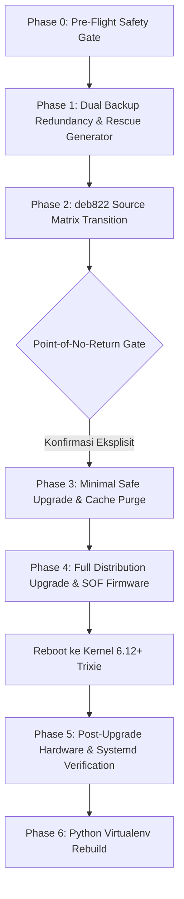

# Panduan & Protokol Otomasi Upgrade Debian 13 (Trixie)

Dokumen ini adalah panduan teknis independen dan protokol operasional resmi untuk migrasi *in-place* dari **Debian 12 (Bookworm)** ke **Debian 13 (Trixie)** pada sistem bare-metal Linux (khususnya perangkat Lenovo IdeaPad 3 / arsitektur Intel Ice Lake) menggunakan modul `osm upgrade` dan engine [`scripts/upgrade_debian_trixie.sh`](file:///home/rizz/dev/os-manager/scripts/upgrade_debian_trixie.sh).

---

## 1. Ikhtisar & Prinsip Keandalan (SRE Invariants)

Proses upgrade distribusi Debian skala penuh membawa risiko terputusnya sesi grafis, kegagalan thermal cut-off, kehabisan partisi root akibat akumulasi cache `.deb`, driver audio bisu (Sound Open Firmware), serta kegagalan konfigurasi DPKG di tengah jalan. Engine ini mengimplementasikan 8 guardrail keandalan mutlak:

| No | Guardrail / Invariant | Mekanisme Enkapsulasi & Proteksi |
|---|---|---|
| **1** | **Sleep & Lid-Switch Inhibition** | Dibungkus `systemd-inhibit` untuk memblokir ACPI suspend/sleep saat laptop ditutup atau idle. |
| **2** | **AC Power Gate** | Validasi mandatory adaptor daya terhubung (`on_ac_power` / `/sys/class/power_supply/`) sebelum eksekusi. |
| **3** | **Isolasi Memori & Anti-OOM** | Proses upgrade dilindungi dengan `oom_score_adj=-1000` dan verifikasi virtual memory $\ge 2.0\text{ GB}$. |
| **4** | **Multiplexer Session Guard** | Wajib berjalan di dalam sesi `tmux` (`osm-trixie-upgrade`) atau `screen` agar tidak terputus saat `gdm3` di-restart. |
| **5** | **Kapasitas Penyimpanan & Cache Stream** | Memeriksa $\ge 15.0\text{ GB}$ di `/` dan $\ge 1.0\text{ GB}$ di `/boot`, menggunakan streaming package `APT::Keep-Downloaded-Packages="false"` dan pembersihan bertahap `apt-get clean`. |
| **6** | **Format deb822 & Firmware Non-Free** | Transisi repositori ke format standar deb822 di `/etc/apt/sources.list.d/debian.sources` dengan retensi `non-free-firmware` dan instalasi wajib `firmware-sof-signed`, `firmware-misc-nonfree`, dan `alsa-ucm-conf`. |
| **7** | **Integritas NetworkManager** | Normalisasi hak akses keyfile `/etc/NetworkManager/system-connections/*` ke `0600` `root:root` sebelum dan sesudah upgrade agar Wi-Fi tidak terputus. |
| **8** | **Dual Backup Redundancy & Rescue Script** | Snapshot tersimpan di `/var/backups/osm/` dan `/mnt/data/osm_backups/` dalam bentuk tarball terkompresi dengan generator `emergency_rescue.sh` mandiri yang memuat opsi recovery GPU (`nouveau.modeset=0`). |

---

## 2. Spesifikasi Hardware & Driver Khusus (Intel Ice Lake)

Upgrade ke Linux Kernel 6.12+ pada Debian 13 membawa perubahan arsitektur driver perangkat keras:

* **Audio Controller (Sound Open Firmware / SOF):**
  * Kernel 6.12+ mewajibkan driver Sound Open Firmware (`snd_sof_pci_intel_icl`) dan mendeprekasi fallback legacy HDA.
  * Engine otomatis mengantrekan dan menginstal `firmware-sof-signed` dan `alsa-ucm-conf`.
* **Konektivitas Nirkabel (Wi-Fi):**
  * Intel Wireless-AC 9560 menggunakan driver `iwlwifi` (`firmware-iwlwifi`).
* **Direct Rendering Manager (DRM) & Dual GPU:**
  * Driver Intel Iris Plus (`i915`) memvalidasi device node `/dev/dri/card0` dan `/dev/dri/renderD128`.
  * Failsafe recovery mencakup parameter kernel `nouveau.modeset=0` dan `modprobe.blacklist=nouveau` jika secondary discrete GPU (NVIDIA MX330) mengalami desinkronisasi Wayland.
* **UEFI Secure Boot & Kernel Lockdown:**
  * Mode kernel lockdown diaudit di `/sys/kernel/security/lockdown` untuk memastikan integritas modul kernel pasca-reboot.

---

## 3. Alur Kerja 6 Fase (Phased Lifecycle)



### Rincian Tiap Fase:

1. **Phase 0 (Pre-Flight Gate):** Memeriksa AC power, RAM/swap, kapasitas disk, DNS, sesi multiplexer, dan dependensi paket yang rusak.
2. **Phase 1 (Dual Backup):** Mencadangkan `/etc/`, `/var/lib/dpkg/`, `/etc/NetworkManager/`, dan `/boot/` ke `/var/backups/osm/` dan `/mnt/data/osm_backups/`. Menghasilkan skrip mandiri `emergency_rescue.sh`.
3. **Phase 2 (deb822 Transition):** Membuat `/etc/apt/sources.list.d/debian.sources` dengan suite `trixie`, `trixie-updates`, `trixie-backports`, dan `trixie-security`. Menonaktifkan list repositori pihak ketiga ke `*.disabled_for_upgrade`.
4. **Phase 3 (Minimal Safe Upgrade):** Menjalankan `apt-get upgrade --without-new-pkgs -y` untuk memperbarui pustaka dasar libc, dpkg, dan apt tanpa menghapus paket lama, diikuti `apt-get clean`.
5. **Phase 4 (Full Distribution Upgrade):** Menginstal firmware audio SOF dan menjalankan `apt-get dist-upgrade -y`. Jika terjadi interupsi, secara otomatis memicu protokol perbaikan darurat DPKG (`dpkg --configure -a` dan `apt-get install -f -y`).
6. **Phase 5 (Hardware & Systemd Audit):** Memverifikasi rilis OS `trixie`, kernel $\ge 6.12$, binding SOF DSP di dmesg, interface Wi-Fi `iwlwifi`, DRM character devices, lockdown mode, dan memastikan 0 unit systemd yang berstatus gagal (`systemctl --failed`).
7. **Phase 6 (Virtualenv Rebuild):** Menghapus virtual environment Python 3.11 yang rusak dan membangun kembali environment baru yang kompatibel dengan runtime Python 3.12+ host.

---

## 4. Panduan Eksekusi CLI (`osm upgrade`)

Modul CLI `osm upgrade` menyediakan antarmuka terpadu yang membungkus skrip engine di bawah manajemen sesi yang aman:

```bash
# 1. Audit Kesiapan Sistem (Phase 0 Pre-Flight)
osm upgrade check

# 2. Simulasi Upgrade Tanpa Perubahan Sistem (Dry-Run)
osm upgrade dry-run

# 3. Eksekusi Live Upgrade (Otomatis bootstrap ke sesi tmux 'osm-trixie-upgrade' & sleep inhibit)
sudo osm upgrade start

# 4. Verifikasi Hardware & Systemd Pasca-Reboot (Phase 5)
osm upgrade verify

# 5. Rebuild Virtual Environment Python Pasca-Upgrade Runtime
osm upgrade rebuild-venv
```

---

## 5. Protokol Pemulihan Darurat (Offline Disaster Recovery)

Jika terjadi pemadaman listrik total atau kegagalan tak terduga saat proses unpacking paket:

1. **Booting melalui Live USB Debian:**
   * Masuk ke Live environment (GNOME / Terminal).
2. **Mount Partisi Root dan Buka Akses Backup:**
   ```bash
   sudo mount /dev/nvme0n1p2 /mnt
   sudo mount /dev/nvme0n1p1 /mnt/boot/efi
   sudo mount /dev/nvme0n1p4 /mnt/data
   ```
3. **Eksekusi Skrip Pemulihan Mandiri:**
   ```bash
   sudo bash /mnt/data/osm_backups/emergency_rescue.sh
   ```
4. **Chroot Manual & Perbaikan DPKG (Jika Diperlukan):**
   ```bash
   sudo for i in dev dev/pts proc sys sys/firmware/efi/efivars run; do mount --bind /$i /mnt/$i; done
   sudo chroot /mnt /bin/bash
   dpkg --configure -a
   apt-get install -f -y
   update-initramfs -u -k all
   update-grub
   exit
   sudo reboot
   ```
