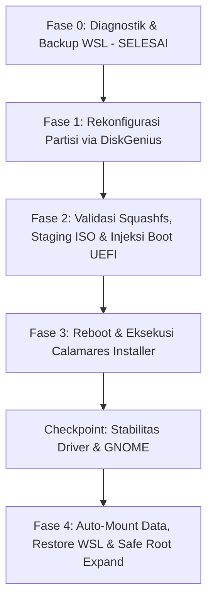

# Blueprint Migrasi Penuh ke Debian Native (Zero USB & Zero External Backup)

Dokumen ini berisi cetak biru (*blueprint*) arsitektur teknis dan prosedur komprehensif untuk memigrasikan sistem dari Windows ke **Debian GNU/Linux (GNOME)** secara penuh pada perangkat Lenovo IdeaPad 3 (81WD) tanpa menggunakan media USB eksternal dan tanpa memindahkan/mem-backup data Drive D ke cloud/media luar.

---

## 1. Keputusan Desain Terverifikasi (Design Alignment)

| Parameter | Keputusan Terpilih | Rationale / Justifikasi |
| :--- | :--- | :--- |
| **Distro Target** | **Debian GNU/Linux** *(Official Live GNOME with non-free firmware)* | Sesuai lingkungan WSL saat ini (`Debian Trixie`), kestabilan jangka panjang, paket dependency teruji. |
| **Desktop Environment** | **GNOME** (Wayland) | Integrasi touchpad/gesture laptop sangat mulus, modern, default Debian. |
| **Root Filesystem** | **ext4** (dengan dynamic Swapfile + opsi LUKS2) | Kompatibilitas dan reliabilitas maksimal, proteksi kredensial developer. |
| **Partisi Data (D:)** | **NTFS (244 GB)** $\rightarrow$ Mount ke `/mnt/data` | Tetap utuh (*in-place*), tidak diformat, data 201 GB aman. |
| **Migrasi Konfigurasi WSL** | Backup `~/*` ke `D:\wsl_backup\` | Dotfiles, SSH keys, git config, dan project runtime langsung di-restore di bare-metal Debian. |

---

## 2. Profil Perangkat & Spesifikasi Hardware

| Komponen | Spesifikasi Terdeteksi | Driver & Modul Kernel Debian |
| :--- | :--- | :--- |
| **Model Laptop** | Lenovo IdeaPad 3 (Type `81WD`) | Kernel ACPI / `ideapad-laptop` |
| **Prosesor (CPU)** | Intel Core i5-1035G1 @ 1.00GHz (4 Core / 8 Thread) | `x86_64` (Intel Ice Lake) |
| **Grafis (GPU)** | Intel UHD Graphics (Ice Lake G1) | Driver kernel `i915` (Mesa 3D) |
| **Konektivitas Nirkabel** | Intel Wireless-AC 9560 (Wi-Fi 5 + BT 5.1) | `iwlwifi` (`firmware-iwlwifi`) |
| **Penyimpanan Utama** | NVMe SSD `SSSTC CL1-4D512` (512 GB) | Driver kernel `nvme` |
| **Tabel Partisi** | GPT (GUID Partition Table) | Native EFI / UEFI Boot Mode |
| **Memori (RAM)** | 8.00 GB DDR4 | Native Linux Memory Management |

---

## 3. Data Diagnostik Administratif & Geometri Partisi Terverifikasi

### Hasil Verifikasi Pra-Migrasi Windows (Status: SELESAI / OK)

| Parameter Diagnostik | Nilai / Status Terverifikasi | Perintah Verifikasi | Catatan Keamanan |
| :--- | :--- | :--- | :--- |
| **Hak Akses Admin** | `True` (Elevated Administrator) | `[WindowsPrincipal]::GetCurrent().IsInRole(...)` | Izin disk raw & BCD granted. |
| **BitLocker Drive C:** | `Fully Decrypted`, `Protection Off` | `manage-bde -status C:` | Siap di-shrink tanpa enkripsi lock. |
| **BitLocker Drive D:** | `Fully Decrypted`, `Protection Off` | `manage-bde -status D:` | Partisi data aman & terbaca Linux. |
| **Fast Startup / Hiber** | `Disabled` (`hiberfil.sys` removed) | `powercfg /h off` | Mencegah NTFS dirty flag / read-only lock. |
| **Integritas NTFS Drive D:** | `Clean` (`NoErrorsFound`) | `Repair-Volume -DriveLetter D -SpotFix` | Index corrupt diperbaiki, boot check dijadwalkan. |
| **Secure Boot UEFI** | `True` (Enabled) | `Confirm-SecureBootUEFI` | Didukung penuh oleh signed shim Debian. |
| **Arsip Backup WSL** | `753 MB` (Verifikasi: `TAR_INTEGRITY_OK`) | `tar -tzf ...` & `sha256sum` | Disimpan di `/mnt/d/wsl_backup/`. |
| **SHA256 Backup WSL** | `0c36b038b3f469b75c7594cab025618399c186d6923274bed3beff23cc8c4daf` | `sha256sum wsl_home_backup.tar.gz` | Checksum valid, tercatat di `wsl_home_backup.sha256`. |

---

### Geometri Partisi Fisik Eksisting (Disk 0: `SSSTC CL1-4D512`)

| Nomor Partisi | Offset Sektor (Bytes) | Ukuran Fisik | File System | Label / Type | Status Aksi Migrasi |
| :---: | :---: | :---: | :---: | :---: | :--- |
| **Partisi 1** | `1,048,576` (1 MB) | `100 MB` | FAT32 | System (EFI ESP) | **PERTAHANKAN** (Mount ke `/boot/efi`, JANGAN FORMAT) |
| **Partisi 2 (C:)** | `105,906,176` (~100 MB) | `226.01 GB` | NTFS | Basic Data (`OS`) | **SHRINK 86–120 GB** $\rightarrow$ Buat Staging FAT32 (8–15 GB) & Unallocated (~71–112 GB) |
| **Partisi 3** | `242,786,385,920` (~226.1 GB) | `5.71 GB` | NTFS | Recovery (WinRE) | **PERTAHANKAN / Biarkan** (Tidak disentuh) |
| **Partisi 4 (D:)** | `248,917,262,336` (~231.8 GB) | `244.14 GB` | NTFS | Basic Data (`DATA_STORE`) | **ZONA AMAN: JANGAN FORMAT / JANGAN HAPUS (201 GB Data)** |

---

## 4. Struktur Partisi: Eksisting vs Target Akhir

### Kondisi Partisi Fisik Saat Ini (Disk 0)
```
Total Storage: 512 GB (NVMe SSD: SSSTC CL1-4D512)
┌─────────────────┬──────────────────────┬────────────────────┬──────────────────────┐
│ Part 1: EFI ESP │ Part 2: Drive C:     │ Part 3: Recovery   │ Part 4: Drive D:     │
│ 100 MB (FAT32)  │ 226.0 GB (NTFS)      │ 5.71 GB (NTFS)     │ 244.14 GB (NTFS)     │
│ Bootloader      │ Windows OS (105G Used│ Windows Recovery   │ DATA_STORE           │
│                 │ / 121G Free)         │                    │ (201G Used / 44G Free│
└─────────────────┴──────────────────────┴────────────────────┴──────────────────────┘
```

---

### Kondisi Sementara (Staging Installer Debian via DiskGenius)
```
┌─────────┬──────────────────────┬─────────────┬─────────────┬──────────────────────┐
│ Part 1  │ Ruang Kosong (Baru)  │ Part Baru   │ Part 3      │ Part 4: Drive D:     │
│ 100 MB  │ ~71 - 112 GB         │ 8 - 15 GB   │ 5.71 GB     │ 244.14 GB (NTFS)     │
│ EFI ESP │ (Unallocated Space)  │ FAT32       │ Recovery    │ Label: "DATA_STORE"  │
│         │ Calon Root Debian /  │ "DEBIAN_SET"│             │ TETAP UTUH (201GB)   │
└─────────┴──────────────────────┴─────────────┴─────────────┴──────────────────────┘
```

---

### Kondisi Target Akhir (Setelah Debian Native Terpasang & Partisi Installer Dihapus)
```
┌─────────────────┬───────────────────────────────────────────┬──────────────────────┐
│ Partisi 1       │ Partisi Debian Utama (Eks C: + Installer) │ Partisi Data (Eks D:)│
│ 100 MB (FAT32)  │ ~230 - 235 GB (ext4)                      │ 244.14 GB (NTFS)     │
│ Mount:          │ Mount:                                    │ Mount:               │
│ /boot/efi       │ / (Root Debian GNOME + /swapfile)         │ /mnt/data            │
└─────────────────┴───────────────────────────────────────────┴──────────────────────┘
```

---

## 5. Alur Prosedur Eksekusi Terstruktur



---

### FASE 0: Persiapan Sistem di Windows (STATUS: SELESAI / OK)

1. **Backup Konfigurasi WSL:**
   * File arsip: `/mnt/d/wsl_backup/wsl_home_backup.tar.gz` (Ukuran: `753 MB`).
   * Checksum: `0c36b038b3f469b75c7594cab025618399c186d6923274bed3beff23cc8c4daf`.
   * Integritas: Validasi via `tar -tzf` sukses tanpa error (`TAR_INTEGRITY_OK`).
2. **Perbaikan File System Drive D:**
   * Diperbaiki via `Repair-Volume -DriveLetter D -SpotFix` (Status: `NoErrorsFound`).
   * Boot-time check dijadwalkan via `chkntfs /c D:`.
3. **Nonaktifkan Fast Startup & Hibernasi:**
   * Dieksekusi via `powercfg /h off` (`hiberfil.sys` dihapus).
4. **Verifikasi BitLocker:**
   * Konversi: `Fully Decrypted`, Proteksi: `Protection Off` pada C: dan D:.

---

### FASE 1: Manajemen Partisi dengan DiskGenius (Panduan Pengguna)

1. **Beri Label Partisi Data (Keamanan Visual):**
   * Buka DiskGenius (WinPE / Windows).
   * Klik kanan Partisi 4 (Drive D:) $\rightarrow$ **Set Volume Label** $\rightarrow$ Isi: `DATA_STORE`.
2. **Backup Tabel Partisi GPT (Dual Format: DiskGenius & Open Standard):**
   * Di DiskGenius: Klik menu **Disk** $\rightarrow$ **Backup Partition Table** $\rightarrow$ Simpan file di `D:\ptf_backup.ptf`.
   * Di Windows PowerShell / Live Linux: Ekspor raw GPT backup ke `D:\gpt_backup.bin`.
3. **Resize Partisi C (Pilih Opsi A atau Opsi B):**
   * Klik kanan Partisi 2 (Drive C:) $\rightarrow$ **Resize Partition**.
   * **Opsi B (Pilihan User - Rekomendasi):** Shrink **86 GB** (C: sisa ~140 GB) $\rightarrow$ Buat Partisi FAT32 **15.0 GB** label `DEBIAN_SET`, sisakan **~71 GB** Unallocated Space.
   * **Opsi A (Default Minimal Layout):** Shrink **120 GB** (C: sisa ~106 GB) $\rightarrow$ Buat Partisi FAT32 **8.0 GB** label `DEBIAN_SET`, sisakan **~112 GB** Unallocated Space.
   * *(Detail langkah-demi-langkah tersedia pada [`docs/migration/PHASE_1_DISKGENIUS_GUIDE.md`](file:///home/rizz/dev/os-manager/docs/migration/PHASE_1_DISKGENIUS_GUIDE.md))*.
4. Klik **Save All** di pojok kiri atas untuk mengeksekusi operasi.

---

### FASE 2: Validasi Squashfs, Staging ISO & Injeksi Boot UEFI

> [!IMPORTANT]
> **Pemeriksaan Batas Ukuran File FAT32 (4 GiB Limit):**
> Partisi FAT32 memiliki batasan maksimal ukuran 1 file sebesar 4 GiB (4.294.967.295 bytes).
> * Debian 12 Live GNOME resmi (`debian-live-12.8.0-amd64-gnome.iso`) berukuran total ~3.1 GB dengan file `live/filesystem.squashfs` berukuran **~2.7 GB** (jauh di bawah batas 4 GiB), sehingga **aman 100% diekstrak ke FAT32**.
> * Jika menggunakan custom image / DVD installer penuh yang memiliki file >4 GB, gunakan partisi staging berbasis **exFAT / NTFS** dengan chainloading GRUB EFI.

1. **Ekstrak Debian Live GNOME ISO:**
   * Buka file ISO Debian Live GNOME via File Explorer / DiskGenius.
   * Salin seluruh isi direktori ISO (`.disk`, `boot`, `d-i`, `dists`, `efi`, `install`, `isolinux`, `live`, `pool`) langsung ke root partisi `DEBIAN_SET` (FAT32 8 GB).
   * Verifikasi bahwa file `DEBIAN_SET:\live\filesystem.squashfs` tersalin utuh.
2. **Daftarkan Boot Entry ke UEFI NVRAM via DiskGenius:**
   * Di DiskGenius, buka menu **Tools** $\rightarrow$ **Set UEFI BIOS boot entries**.
   * Klik tombol **Add**.
   * Pilih Disk: `Disk 0 (NVMe)`.
   * Pilih Partisi: `DEBIAN_SET (FAT32)`.
   * File path loader: `\EFI\BOOT\BOOTX64.EFI`.
   * Beri nama label boot entry: `Debian Live Installer`.
   * Klik tombol **Move Up** agar entri ini berada di urutan paling atas.
   * Klik **Save Current Boot Entry** lalu tutup.

---

### FASE 3: Proses Instalasi Debian Native (Manual Partitioning)

1. **Restart Komputer:**
   * Laptop akan booting langsung ke Live Environment Debian GNOME dari partisi `DEBIAN_SET`.
2. **Buka Installer (Calamares / Debian Installer):**
   * Buka icon **Install Debian** di desktop GNOME Live.
   * Pilih bahasa, zona waktu (`Asia/Jakarta`), dan keyboard layout.
3. **Atur Partisi Manual (Manual Partitioning):**
   * Pilih opsi **Manual Partitioning**.
   * **Partisi 1 (100 MB EFI ESP):**
     * Edit $\rightarrow$ Mount point: `/boot/efi` $\rightarrow$ **JANGAN CENTANG FORMAT**.
   * **Ruang Kosong (Unallocated Space ~112 GB):**
     * Klik Create $\rightarrow$ Filesystem: `ext4` $\rightarrow$ Mount point: `/` (Root) $\rightarrow$ Format: `Yes`.
     * *(Opsional Keamanan Kredensial Developer)*: Anda dapat mencentang opsi **Encrypt system (LUKS2)** untuk mengenkripsi partisi root agar SSH keys, API keys, dan file penting terlindungi saat laptop mati/hilang.
   * **Partisi 4 (`DATA_STORE` 244 GB NTFS):**
     * **JANGAN DISENTUH / JANGAN FORMAT**.
   * **Lokasi Bootloader:** Pilih `/dev/nvme0n1`.
4. Selesaikan pembuatan akun pengguna (`rizz`), password, lalu jalankan instalasi hingga selesai (100%).
5. Reboot sistem ke Debian Bare-Metal.

---

### CHECKPOINT: Verifikasi Stabilitas Sistem (Quality Gate)

> [!WARNING]
> **JANGAN HAPUS partisi installer atau partisi eks-Windows sebelum memenuhi kriteria Quality Gate ini:**
> 1. Sistem telah berhasil reboot normal minimal 2–3 kali tanpa kernel panic.
> 2. Wi-Fi Intel AC 9560 (`iwlwifi`) terhubung stabil dan internet berfungsi lancar.
> 3. Audio, Bluetooth, dan Touchpad gesture berfungsi normal.
> 4. Fitur **Suspend & Resume** (tutup-buka layar laptop) berjalan normal tanpa freeze.
> 5. Sesi GNOME Wayland berjalan mulus dengan akselerasi grafis Intel Iris Plus/UHD (`i915`).

---

### FASE 4: Konfigurasi Pasca-Instalasi di Debian Native

1. **Konfigurasi Auto-Mount Partisi Data NTFS di `/etc/fstab`:**
   Buka terminal di Debian:
   ```bash
   sudo mkdir -p /mnt/data
   UUID_DATA=$(sudo blkid -s UUID -o value /dev/nvme0n1p4)
   echo "UUID=${UUID_DATA}  /mnt/data  ntfs-3g  defaults,uid=1000,gid=1000,umask=022,nofail  0  0" | sudo tee -a /etc/fstab
   sudo mount -a
   ls -la /mnt/data
   ```
2. **Restore Konfigurasi & Lingkungan Kerja WSL:**
   ```bash
   tar -xzvf /mnt/data/wsl_backup/wsl_home_backup.tar.gz -C ~/
   ```
3. **Setup Swapfile Dinamis (Rekomendasi 8 GB):**
   ```bash
   sudo fallocate -l 8G /swapfile
   sudo chmod 600 /swapfile
   sudo mkswap /swapfile
   sudo swapon /swapfile
   echo '/swapfile none swap sw 0 0' | sudo tee -a /etc/fstab
   ```
4. **Pembersihan & Ekspansi Partisi Root yang Aman (*Safe Online Resize*):**
   *Setelah Quality Gate terpenuhi*, hapus partisi sementara `DEBIAN_SET` via `gnome-disks` atau `gdisk`, lalu perluas partisi root secara aman dengan urutan perintah berikut:
   ```bash
   # 1. Pastikan paket cloud-guest-utils terpasang (berisi growpart)
   sudo apt update && sudo apt install -y cloud-guest-utils
   
   # 2. Perluas batas tabel partisi ke ruang kosong (ganti angka 2 sesuai nomor partisi root)
   sudo growpart /dev/nvme0n1 2
   
   # 3. Perluas filesystem ext4 secara online tanpa unmount
   sudo resize2fs /dev/nvme0n1p2
   
   # 4. Verifikasi kapasitas akhir
   df -hT /
   ```
