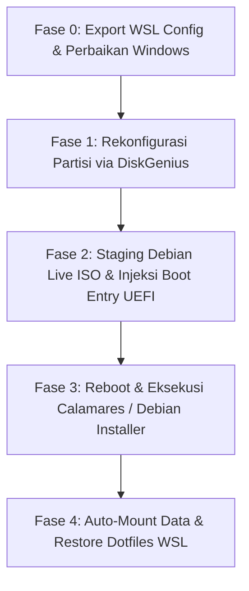

# Blueprint Migrasi Penuh ke Debian Native (Zero USB & Zero External Backup)

Dokumen ini berisi cetak biru (*blueprint*) arsitektur teknis dan prosedur komprehensif untuk memigrasikan sistem dari Windows ke **Debian GNU/Linux (GNOME)** secara penuh pada perangkat Lenovo IdeaPad 3 (81WD) tanpa menggunakan media USB eksternal dan tanpa memindahkan/mem-backup data Drive D ke cloud/media luar.

---

## 1. Keputusan Desain Terverifikasi (Design Alignment)

| Parameter | Keputusan Terpilih | Rationale / Justifikasi |
| :--- | :--- | :--- |
| **Distro Target** | **Debian GNU/Linux** *(Official Live GNOME with non-free firmware)* | Sesuai lingkungan WSL saat ini (`Debian Trixie`), kestabilan jangka panjang, paket dependency teruji. |
| **Desktop Environment** | **GNOME** (Wayland) | Integrasi touchpad/gesture laptop sangat mulus, modern, default Debian. |
| **Root Filesystem** | **ext4** (dengan Swapfile) | Kompatibilitas dan reliabilitas maksimal, zero maintenance overhead. |
| **Partisi Data (D:)** | **NTFS (244 GB)** $\rightarrow$ Mount ke `/mnt/data` | Tetap utuh (in-place), tidak diformat, data 201 GB aman. |
| **Migrasi Konfigurasi WSL** | Backup `~/*` ke `D:\wsl_backup\` | Dotfiles, SSH keys, git config, dan project runtime langsung di-restore di bare-metal Debian. |

---

## 2. Profil Perangkat & Spesifikasi Hardware

| Komponen | Spesifikasi Terdeteksi | Driver & Modul Kernel Debian |
| :--- | :--- | :--- |
| **Model Laptop** | Lenovo IdeaPad 3 (Type `81WD`) | Kernel ACPI / `ideapad-laptop` |
| **Prosesor (CPU)** | Intel Core i5-1035G1 @ 1.00GHz (4 Core / 8 Thread) | `x86_64` (Intel Ice Lake) |
| **Grafis (GPU)** | Intel UHD Graphics (Ice Lake G1) | Driver kernel `i915` (Mesa 3D) |
| **Konektivitas Nirkabel** | Intel Wireless-AC 9560 (Wi-Fi 5 + BT 5.1) | `iwlwifi` (`firmware-iwlwifi`) |
| **Penyimpanan Utama** | NVMe SSD `SSSTC CL1-4D512` (512 GB) | Driver kernel `nvme` |
| **Tabel Partisi** | GPT (GUID Partition Table) | Native EFI |
| **Memori (RAM)** | 8.00 GB DDR4 | Native |

---

## 3. Struktur Partisi: Eksisting vs Target Akhir

### Kondisi Partisi Fisik Saat Ini (Disk 0)
```
Total Storage: 512 GB (NVMe SSD)
┌─────────────────┬──────────────────────┬────────────────────┬──────────────────────┐
│ Part 1: EFI ESP │ Part 2: Drive C:     │ Part 3: Recovery   │ Part 4: Drive D:     │
│ 100 MB (FAT32)  │ 226.0 GB (NTFS)      │ 5.7 GB (NTFS)      │ 244.1 GB (NTFS)      │
│ Bootloader      │ Windows OS (105G Used│ Windows Recovery   │ DATA PENTING         │
│                 │ / 121.5G Free)       │                    │ (201G Used / 44G Free│
└─────────────────┴──────────────────────┴────────────────────┴──────────────────────┘
```

---

### Kondisi Sementara (Staging Installer Debian - Tahap 1)
```
┌─────────┬──────────────────────┬─────────────┬─────────────┬──────────────────────┐
│ Part 1  │ Ruang Kosong (Baru)  │ Part Baru   │ Part 3      │ Part 4: Drive D:     │
│ 100 MB  │ ~118 GB              │ 8.0 GB      │ 5.7 GB      │ 244.1 GB (NTFS)      │
│ EFI ESP │ (Unallocated Space)  │ FAT32       │ Recovery    │ Label: "DATA_STORE"  │
│         │ Calon Root Debian /  │ "DEBIAN_SET"│             │ TETAP UTUH (201GB)   │
└─────────┴──────────────────────┴─────────────┴─────────────┴──────────────────────┘
```

---

### Kondisi Target Akhir (Setelah Debian Native Terpasang)
```
┌─────────────────┬───────────────────────────────────────────┬──────────────────────┐
│ Partisi 1       │ Partisi Debian Utama (Eks C: + Installer) │ Partisi Data (Eks D:)│
│ 100 MB (FAT32)  │ ~230 - 235 GB (ext4)                      │ 244.1 GB (NTFS)      │
│ Mount:          │ Mount:                                    │ Mount:               │
│ /boot/efi       │ / (Root Debian GNOME)                     │ /mnt/data            │
└─────────────────┴───────────────────────────────────────────┴──────────────────────┘
```

---

## 4. Alur Prosedur Eksekusi Terstruktur



---

### FASE 0: Persiapan Sistem di Windows (Admin Terminal)

1. **Backup Konfigurasi WSL:**
   Jalankan backup dotfiles, SSH, git config ke `D:\wsl_backup\`:
   ```bash
   mkdir -p /mnt/d/wsl_backup
   tar -czvf /mnt/d/wsl_backup/wsl_home_backup.tar.gz -C /home/rizz .bashrc .profile .ssh .gitconfig .agents dev
   ```
2. **Jalankan Perbaikan File System Drive D:**
   Buka Command Prompt (Run as Administrator):
   ```cmd
   chkdsk D: /f /r
   ```
3. **Nonaktifkan Fast Startup & Hibernation:**
   ```cmd
   powercfg /h off
   ```
4. **Verifikasi BitLocker:**
   ```cmd
   manage-bde -status
   ```
   *(Pastikan status Protection Off dan Decrypted untuk C: dan D:)*

---

### FASE 1: Manajemen Partisi dengan DiskGenius

1. **Beri Label Partisi Data:**
   * Klik kanan Partisi 4 (Drive D:) $\rightarrow$ **Set Volume Label** $\rightarrow$ Isi: `DATA_STORE`.
2. **Backup Tabel Partisi GPT:**
   * Klik menu **Disk** $\rightarrow$ **Backup Partition Table** $\rightarrow$ Simpan di `D:\ptf_backup.ptf`.
3. **Resize Partisi C:**
   * Klik kanan Partisi 2 (Drive C:) $\rightarrow$ **Resize Partition**.
   * Perkecil Drive C: sebesar **120 GB**.
   * Dari ruang bebas tersebut:
     * Buat 1 Partisi baru ukuran **8.0 GB**, Tipe: **Primary**, Format: **FAT32**, Label: `DEBIAN_SET`.
     * Sisanya (~112 GB) biarkan sebagai **Unallocated Space**.
4. Klik **Save All** di pojok kiri atas untuk mengeksekusi.

---

### FASE 2: Staging Debian Live GNOME ISO & Injeksi Boot UEFI

1. **Unduh & Ekstrak Debian Live GNOME ISO:**
   * Unduh `debian-live-*-amd64-gnome+nonfree.iso`.
   * Ekstrak seluruh isi file ISO ke dalam partisi `DEBIAN_SET` (FAT32 8 GB).
2. **Daftarkan Boot Entry ke UEFI via DiskGenius:**
   * Buka menu **Tools** $\rightarrow$ **Set UEFI BIOS boot entries**.
   * Klik **Add**.
   * Pilih Partisi: `DEBIAN_SET (FAT32)`.
   * File path loader: `\EFI\BOOT\BOOTX64.EFI`.
   * Beri nama label: `Debian Live Installer`.
   * Klik **Move Up** ke urutan teratas $\rightarrow$ Klik **Save Current Boot Entry**.

---

### FASE 3: Proses Instalasi Debian Native (Manual Partitioning)

1. **Restart Komputer:**
   * Laptop akan booting langsung ke Live Environment Debian GNOME.
2. **Buka Installer (Calamares / Debian Installer):**
   * Pilih opsi **Manual Partitioning / Something Else**.
3. **Atur Mount Point:**
   * **Partisi 1 (100 MB EFI):** Set Mount Point ke `/boot/efi` (**JANGAN FORMAT**).
   * **Unallocated Space (~112 GB):** Klik Create $\rightarrow$ Filesystem: `ext4`, Mount Point: `/` (Root).
   * **Partisi `DATA_STORE` (244 GB NTFS):** **JANGAN DI-FORMAT**. Mount point opsional: `/mnt/data`.
4. **Pilih Bootloader Location:** `/dev/nvme0n1`.
5. Selesaikan instalasi dan reboot ke sistem baru.

---

### FASE 4: Konfigurasi Pasca-Instalasi di Debian Native

1. **Konfigurasi Auto-Mount Partisi Data NTFS di `/etc/fstab`:**
   ```bash
   sudo mkdir -p /mnt/data
   UUID_DATA=$(sudo blkid -s UUID -o value /dev/nvme0n1p4)
   echo "UUID=${UUID_DATA}  /mnt/data  ntfs-3g  defaults,uid=1000,gid=1000,umask=022,nofail  0  0" | sudo tee -a /etc/fstab
   sudo mount -a
   ```
2. **Restore Konfigurasi WSL:**
   ```bash
   tar -xzvf /mnt/data/wsl_backup/wsl_home_backup.tar.gz -C ~/
   ```
3. **Pembersihan Partisi Installer:**
   * Hapus partisi sementara 8 GB (`DEBIAN_SET`) menggunakan `sudo cfdisk /dev/nvme0n1`.
   * Perluas partisi root `/` untuk memanfaatkan 8 GB tersebut kembali.
