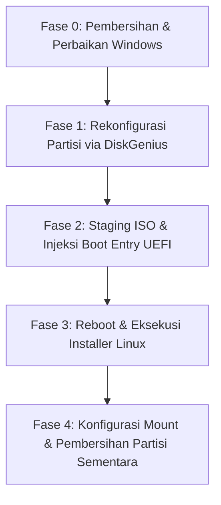

# Blueprint Migrasi Penuh ke Linux (Zero USB & Zero External Backup)

Dokumen ini berisi cetak biru (*blueprint*) arsitektur teknis dan prosedur komprehensif untuk memigrasikan sistem dari Windows ke Linux secara penuh pada perangkat ini tanpa menggunakan media USB eksternal dan tanpa memindahkan/mem-backup data Drive D ke cloud/media luar.

---

## 1. Profil Perangkat & Temuan Sistem

Berdasarkan hasil pemindaian langsung menggunakan utilitas sistem (Linux & Windows WMI/CIM/PowerShell):

### A. Spesifikasi Perangkat Keras
| Komponen | Spesifikasi Terdeteksi | Dukungan Kernel Linux |
| :--- | :--- | :--- |
| **Model Laptop** | Lenovo IdeaPad 3 (Type `81WD`) | Native (Lenovo ACPI / ideapad-laptop) |
| **Prosesor (CPU)** | Intel Core i5-1035G1 @ 1.00GHz (4 Core / 8 Thread) | Native `x86_64` (Intel Ice Lake) |
| **Grafis (GPU)** | Intel UHD Graphics (Ice Lake G1) | Native kernel driver `i915` |
| **Konektivitas Nirkabel** | Intel Wireless-AC 9560 (Wi-Fi 5 + Bluetooth 5.1) | Native module `iwlwifi` + `btintel` |
| **Penyimpanan Utama** | NVMe SSD `SSSTC CL1-4D512` (512 GB) | Native module `nvme` |
| **Tabel Partisi** | GPT (GUID Partition Table) | Native EFI / GPT support |
| **Memori (RAM)** | 8.00 GB DDR4 | Native |

---

## 2. Analisis Struktur Partisi: Eksisting vs Target

### Kondisi Partisi Fisik Saat Ini (Disk 0)
```
Total Storage: 512 GB (NVMe SSD)
┌─────────────────┬──────────────────────┬────────────────────┬──────────────────────┐
│ Part 1: EFI ESP │ Part 2: Drive C:     │ Part 3: Recovery   │ Part 4: Drive D:     │
│ 100 MB (FAT32)  │ 226.0 GB (NTFS)      │ 5.7 GB (NTFS)      │ 244.1 GB (NTFS)      │
│ Bootloader      │ Windows OS (105G Used│ Windows Recovery   │ DATA PENTING         │
│                 │ / 121.5G Free)       │                    │ (201G Used / 44G Free│
└─────────────────┴──────────────────────┴────────────────────┴──────────────────────┘
```

---

### Kondisi Sementara (Staging Installer Lokal - Tahap 1)
```
┌─────────┬──────────────────────┬─────────────┬─────────────┬──────────────────────┐
│ Part 1  │ Ruang Kosong (Baru)  │ Part Baru   │ Part 3      │ Part 4: Drive D:     │
│ 100 MB  │ ~118 GB              │ 8.0 GB      │ 5.7 GB      │ 244.1 GB (NTFS)      │
│ EFI ESP │ (Unallocated Space)  │ FAT32       │ Recovery    │ TETAP UTUH           │
│         │ Calon Root Linux     │ "LINUX_SET" │             │ TIDAK TERSENTUH      │
└─────────┴──────────────────────┴─────────────┴─────────────┴──────────────────────┘
```

---

### Kondisi Target Akhir (Setelah Linux Terpasang Penuh)
```
┌─────────────────┬───────────────────────────────────────────┬──────────────────────┐
│ Partisi 1       │ Partisi Linux Utama (Eks C: + Installer)  │ Partisi Data (Eks D:)│
│ 100 MB (FAT32)  │ ~230 - 235 GB (ext4 / btrfs)              │ 244.1 GB (NTFS)      │
│ Mount:          │ Mount:                                    │ Mount:               │
│ /boot/efi       │ / (Root filesystem Linux)                 │ /mnt/data            │
└─────────────────┴───────────────────────────────────────────┴──────────────────────┘
```

---

## 3. Matriks Risiko & Mitigasi

| Potensi Risiko | Tingkat | Rencana Mitigasi |
| :--- | :---: | :--- |
| **Kesalahan format partisi Data** | Kritis | Partisi D diberi label tegas `DATA_STORE` di DiskGenius dan diverifikasi ulang kapasitasnya (244 GB) sebelum eksekusi di installer. |
| **Filesystem NTFS Terkunci / Read-Only** | Tinggi | Matikan *Windows Fast Startup* & *Hibernation* sebelum migrasi. |
| **Kerusakan Integritas NTFS D:** | Sedang | Menjalankan `chkdsk D: /f` sebelum partisi disentuh (karena terdeteksi status *Repair Needed* pada scan). |
| **Kegagalan Boot Installer Lokal** | Sedang | Daftarkan file `.efi` installer langsung ke NVRAM UEFI menggunakan fitur *Set UEFI BIOS boot entries* di DiskGenius. |

---

## 4. Alur Prosedur Eksekusi Terstruktur



---

### FASE 0: Persiapan Sistem di Windows

1. **Jalankan Perbaikan File System Drive D:**
   Buka Command Prompt (Run as Administrator):
   ```cmd
   chkdsk D: /f /r
   ```
2. **Nonaktifkan Fast Startup & Hibernation:**
   ```cmd
   powercfg /h off
   ```
3. **Pindahkan Berkas User:**
   Pastikan seluruh file dari Desktop, Downloads, Documents di Drive C: sudah dipindahkan ke folder khusus di Drive D: (misalnya `D:\Backup_C\`).

---

### FASE 1: Manajemen Partisi dengan DiskGenius

1. **Beri Label Partisi:**
   * Klik kanan Partisi 4 (Drive D:) $\rightarrow$ **Set Volume Label** $\rightarrow$ Isi: `DATA_STORE`.
2. **Backup Tabel Partisi:**
   * Klik menu **Disk** $\rightarrow$ **Backup Partition Table** $\rightarrow$ Simpan file cadangan `.ptf` di `D:\ptf_backup.ptf`.
3. **Resize / Split Partisi C:**
   * Klik kanan Partisi 2 (Drive C:) $\rightarrow$ pilih **Resize Partition**.
   * Perkecil Drive C: sebesar **120 GB** ke arah kanan (ruang sisa).
   * Dari ruang kosong tersebut:
     * Buat 1 Partisi baru ukuran **8.0 GB**, tipe: **Primary/Basic**, File System: **FAT32**, Label: `LINUX_SETUP`.
     * Sisanya (~112 GB) biarkan berstatus **Unallocated Space**.
4. Klik **Save All** di pojok kiri atas untuk menerapkan perubahan.

---

### FASE 2: Staging ISO & Pendaftaran Boot Entry UEFI

1. **Ekstraksi ISO Distro Linux:**
   * Unduh file `.iso` distro pilihan (contoh: Ubuntu Desktop LTS / Linux Mint / Fedora).
   * Buka file ISO menggunakan 7-Zip atau WinRAR, lalu ekstrak seluruh isi direktori ISO ke dalam root partisi `LINUX_SETUP` (FAT32 8 GB).
2. **Daftarkan Boot Entry ke UEFI NVRAM via DiskGenius:**
   * Buka menu **Tools** $\rightarrow$ **Set UEFI BIOS boot entries**.
   * Klik **Add**.
   * Pilih Disk: `Disk 0`, Partisi: `LINUX_SETUP (FAT32)`.
   * Arahkan file loader: `\EFI\BOOT\bootx64.efi` (atau `\EFI\BOOT\grubx64.efi`).
   * Beri nama label: `Linux Local Installer`.
   * Klik **Move Up** agar berada di urutan teratas $\rightarrow$ Klik **Save Current Boot Entry**.

---

### FASE 3: Proses Instalasi Linux (Manual Partitioning)

1. **Restart Komputer:**
   * Komputer akan otomatis masuk ke Live Environment Linux Installer.
2. **Pilih Metode Partisi Manual:**
   * Saat installer menanyakan tipe instalasi, pilih **"Something Else" / "Manual Partitioning" / "Custom"**.
3. **Konfigurasi Mount Point:**
   * **Partisi 1 (EFI 100 MB):** Set sebagai `EFI System Partition` (Mount: `/boot/efi`). **JANGAN FORMAT**.
   * **Unallocated Space (~112 GB):** Klik tanda `+` / Create $\rightarrow$ Type: `ext4` atau `btrfs`, Mount point: `/` (Root).
   * **Partisi `DATA_STORE` (244 GB NTFS):** **JANGAN CENTANG FORMAT!** Set mount point opsional ke `/mnt/data`.
4. **Bootloader Installation Device:**
   * Pilih `/dev/nvme0n1` (Disk utama).
5. Klik **Install Now** dan selesaikan setup pengguna (Username, Hostname, Password).

---

### FASE 4: Konfigurasi Pasca-Instalasi di Linux

1. **Konfigurasi Auto-Mount Partisi Data NTFS:**
   Identifikasi UUID partisi data:
   ```bash
   sudo blkid -s UUID -o value /dev/nvme0n1p4
   ```
   Buat direktori mount point:
   ```bash
   sudo mkdir -p /mnt/data
   ```
   Tambahkan ke `/etc/fstab` (menggunakan driver native `ntfs3` / `ntfs-3g`):
   ```text
   UUID=<UUID_PARTISI_D>  /mnt/data  ntfs-3g  defaults,uid=1000,gid=1000,umask=022,nofail  0  0
   ```
2. **Pembersihan Partisi Installer:**
   Setelah sistem Linux berjalan normal:
   * Hapus partisi sementara 8 GB (`LINUX_SETUP`) menggunakan utilitas `cfdisk` atau GParted.
   * Perluas (*extend*) partisi root `/` untuk memanfaatkan kembali kapasitas 8 GB tersebut.

---

## 5. Ringkasan Parameter Teknis

```yaml
system_profile:
  device: "Lenovo IdeaPad 3 14IIL05 / 15IIL05 (81WD)"
  cpu: "Intel Core i5-1035G1 (Ice Lake)"
  gpu: "Intel UHD Graphics G1 (i915)"
  wifi_bt: "Intel Wireless-AC 9560 (iwlwifi)"
  storage_controller: "NVMe SSSTC CL1-4D512"
  partition_table: "GPT"
partition_plan:
  efi_partition: "/dev/nvme0n1p1 (100MB, FAT32) -> /boot/efi"
  linux_root: "/dev/nvme0n1p2 (~115-230GB, ext4/btrfs) -> /"
  data_store: "/dev/nvme0n1p4 (244GB, NTFS, UNTOUCHED) -> /mnt/data"
  temp_installer: "8GB FAT32 (Auto-reclaimed post-install)"
```
