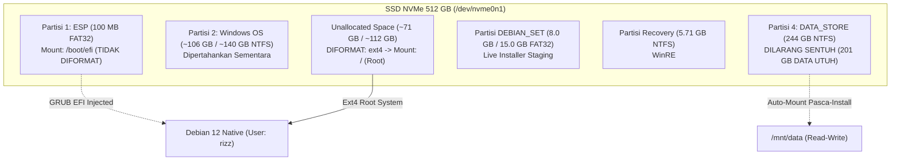

# Panduan Fase 3: Protokol Instalasi Native Debian 12 & Manual Partitioning via Calamares

Panduan operasional dan protokol teknis langkah-demi-langkah ini memandu proses instalasi bare-metal **Debian GNU/Linux 12 (Bookworm) Live GNOME** pada laptop **Lenovo IdeaPad 3 (81WD)** dengan penyimpanan internal SSD NVMe 512 GB (`SSSTC CL1-4D512`), menggunakan installer grafis **Calamares** dengan metode partisi manual (*Manual Partitioning*), serta menjamin **keamanan mutlak 100% *in-place* data 201 GB pada Partisi 4 (`DATA_STORE`)**.

---

## 1. Ringkasan Arsitektur & Prinsip Zero-Data-Loss

Instalasi dilakukan langsung dari Live Environment Debian yang telah di-boot dari partisi staging `DEBIAN_SET` (8.0 GB s/d 15.0 GB FAT32) tanpa bantuan USB drive. Installer Calamares akan mengalokasikan sistem operasi Debian baru ke dalam **ruang unallocated (~71 GB s/d ~112 GB)** yang telah disiapkan pada Fase 1.



---

## 2. Peringatan Keamanan Kritis (Critical Safety Guardrails)

> [!CAUTION]
> **ATURAN KESELAMATAN PARTISI DATA MUTLAK:**
> 1. **DILARANG KERAS** memilih opsi **"Erase Disk"** (*Hapus Disk*) di Calamares! Opsi tersebut akan menghapus seluruh tabel partisi NVMe dan memusnahkan 201 GB data pada Drive D:.
> 2. **WAJIB** memilih opsi **"Manual Partitioning"** (*Partisi Manual*).
> 3. **DILARANG MENYENTUH ATAU MENAMBAHKAN MOUNT POINT** pada **Partisi 4 (`DATA_STORE` / NTFS ~244 GB)** selama proses instalasi Calamares. Partisi ini akan di-mount secara otomatis dan aman pada Fase 4.

---

## 3. Matriks Alokasi Partisi Manual (Partition Assignment Table)

Tabel berikut adalah acuan mutlak konfigurasi partisi pada layar *Manual Partitioning* Calamares:

| Target Partisi / Device | Tipe File System | Ukuran | Titik Kait (*Mount Point*) | Centang Format? | Catatan & Instruksi Kritis |
| :--- | :---: | :---: | :---: | :---: | :--- |
| **Partisi 1 (`/dev/nvme0n1p1`)** | `fat32` | `100 MB` | `/boot/efi` | **JANGAN (Keep)** | EFI System Partition eksisting. **DILARANG FORMAT** agar registrasi bootloader EFI aman. |
| **Free Space (Unallocated)** | `ext4` | `~71 GB s/d ~112 GB` | `/` (Root) | **YA (Format)** | Klik *Create* pada ruang kosong. Pilih ext4, mount ke root (`/`). *(Opsional: Centang Encrypt system LUKS2)*. |
| **Partisi 2 (`/dev/nvme0n1p2`)** | `ntfs` | `~106 GB / ~140 GB` | *(Kosongkan)* | **JANGAN (Keep)** | Partisi sistem Windows lama. Jangan disentuh (dihapus/di-expand pada Fase 5 setelah Quality Gate lolos). |
| **Partisi Staging (`DEBIAN_SET`)** | `fat32` | `8.0 GB / 15.0 GB` | *(Kosongkan)* | **JANGAN (Keep)** | Media live installer aktif saat ini. Jangan diedit. |
| **Partisi 3 (`/dev/nvme0n1p3`)** | `ntfs` | `5.71 GB` | *(Kosongkan)* | **JANGAN (Keep)** | Partisi Windows Recovery (WinRE). |
| **Partisi 4 (`/dev/nvme0n1p4`)** | `ntfs` | `244.1 GB` | *(Kosongkan)* | **JANGAN (DO NOT TOUCH)** | **ZONA DATA UTUH (201 GB)**. Berlabel `DATA_STORE` atau `New Volume`. Dilarang ubah! |
| **Lokasi Boot Loader (*Install boot loader on:*)** | - | - | `/dev/nvme0n1` | - | Pilih Master Drive NVMe SSD (`/dev/nvme0n1 SSSTC CL1-4D512`). |

---

## 4. Panduan Langkah-Demi-Langkah Calamares Installer

### Langkah 1: Memulai Live Environment Debian GNOME
1. Setelah reboot dari Windows, laptop Lenovo IdeaPad 3 akan memuat kernel Linux dari partisi `DEBIAN_SET`.
2. Anda akan disambut oleh desktop grafis **Debian GNU/Linux 12 (GNOME Wayland Live)**.
3. *(Opsional)* Hubungkan Wi-Fi laptop ke router/hotspot via menu status pojok kanan atas untuk memastikan koneksi internet aktif.

---

### Langkah 2: Membuka Installer Calamares
1. Klik icon **Install Debian** pada desktop atau buka dari menu aplikasi GNOME (*Activities* -> ketik *Install Debian*).
2. Jendela instalasi **Calamares** akan terbuka.

---

### Langkah 3: Pengaturan Bahasa, Lokasi, dan Keyboard
1. **Welcome (Bahasa):**
   * Pilih **American English** (atau *Bahasa Indonesia* sesuai preferensi).
   * Klik **Next**.
2. **Location (Zona Waktu):**
   * Region: **Asia**
   * Zone: **Jakarta** (WIB / UTC+7)
   * Klik **Next**.
3. **Keyboard (Tata Letak Tombol):**
   * Model: **Generic 105-key PC** (default)
   * Layout: **English (US) - Default**
   * Uji coba pengetikan tanda baca (`@`, `#`, `$`, `/`) di kotak teks bawah untuk memastikan akurasi layout.
   * Klik **Next**.

---

### Langkah 4: Layar Partisi (*Partitions*) - TAHAP KRITIS
1. Pada pilihan mode partisi, pilih radio button: **Manual Partitioning** (*Partisi Manual*).
2. Klik **Next**.
3. Pastikan dropdown storage drive di bagian atas memilih: **`SSSTC CL1-4D512` (/dev/nvme0n1)**.
4. **Konfigurasi Partisi 1 (EFI System Partition):**
   * Klik pada baris `/dev/nvme0n1p1` (100 MB, FAT32).
   * Klik tombol **Edit**.
   * Di jendela dialog *Edit Existing Partition*:
     * **Mount Point**: Pilih atau ketik `/boot/efi`.
     * **Keep / Format**: Pastikan opsi **Keep** (Jangan centang kotak Format).
     * **Flags**: Pastikan centang `boot` atau `esp` (jika tersedia).
     * Klik **OK**.
5. **Konfigurasi Ruang Bebas (Root Debian Ext4):**
   * Klik pada baris **Free Space / Unallocated Space** (berukuran ~71 GB atau ~112 GB).
   * Klik tombol **Create**.
   * Di jendela dialog *Create Partition*:
     * **Size**: Biarkan nilai default maksimal (seluruh ruang unallocated).
     * **Partition Type**: Primary Partition.
     * **File System**: **`ext4`**.
     * **Mount Point**: Pilih **`/`** (Root).
     * **Format**: Ya (secara otomatis tercentang).
     * **Flags**: (opsional, biarkan default).
     * *(Opsional Enkripsi LUKS2)*: Jika Anda ingin mengenkripsi kredensial SSH/API keys pengembang, centang **Encrypt** dan masukkan passphrase yang kuat.
     * Klik **OK**.
6. **Verifikasi Partisi 4 (`DATA_STORE` / NTFS 244 GB):**
   * Pastikan baris `/dev/nvme0n1p4` memiliki kolom *Mount Point* kosong dan kolom *Format* kosong/No.
7. **Pilih Lokasi Bootloader:**
   * Di bagian bawah layar (*Install boot loader on:*), pilih: **Master Boot Record of SSSTC CL1-4D512 (/dev/nvme0n1)** atau **System Partition (/dev/nvme0n1p1)**.
8. Klik **Next**.

---

### Langkah 5: Pembuatan Akun Pengguna (*Users*)
1. Masukkan informasi akun administrator:
   * **What is your name?**: `rizz`
   * **What name do you want to use to log in?**: `rizz`
   * **What is the name of this computer?**: `ideapad-debian` (atau nama host pilihan Anda).
   * **Choose a password / Confirm password**: Masukkan password yang kuat dan mudah Anda ingat.
2. Centang opsi: **Give this user administrator privileges (sudo)**.
3. *(Rekomendasi)* **JANGAN** centang *Log in automatically without asking for the password* demi keamanan workstation.
4. Klik **Next**.

---

### Langkah 6: Tinjauan Ringkasan (*Summary Review*) - Checkpoint Terakhir
Periksa ringkasan yang ditampilkan Calamares sebelum proses penulisan disk dimulai:

* **Location:** `Asia/Jakarta`
* **Keyboard:** `English (US)`
* **Partitions to be modified:**
  * Keep `/dev/nvme0n1p1` as `fat32` with mount point `/boot/efi`
  * Create new `ext4` partition on free space (~112 GB) with mount point `/`
  * Keep `/dev/nvme0n1p4` (`DATA_STORE`) untouched
  * Install bootloader on `/dev/nvme0n1`
* **Users:** User `rizz` with administrator (sudo) access.

Jika seluruh konfigurasi di atas telah sesuai, klik **Install** -> klik **Install Now**.

---

### Langkah 7: Proses Instalasi & Penyelesaian
1. Calamares akan memformat ruang kosong menjadi filesystem `ext4`, mengekstrak image Debian base system, mengonfigurasi kernel, men-generate initramfs, dan menginstal GRUB EFI bootloader.
2. Proses ini berlangsung sekitar **4–8 menit** pada SSD NVMe.
3. Setelah progress mencapai **100% (All done)**:
   * Centang kotak **Restart now**.
   * Klik **Done**.
4. Laptop akan reboot.

---

## 5. Verifikasi First-Boot Bare-Metal (Transisi ke Checkpoint Quality Gate)

Saat laptop menyala kembali, GRUB Bootloader Debian 12 akan muncul secara otomatis.
1. Pilih **Debian GNU/Linux** pada menu GRUB.
2. Masukkan passphrase LUKS2 (jika diaktifkan saat instalasi), lalu login dengan akun user `rizz`.
3. Setelah masuk ke GNOME Desktop, buka terminal dan jalankan audit **Quality Gate** (Fase Checkpoint):

```bash
# Jalankan skrip audit kesiapan hardware bare-metal
./scripts/migration/quality_gate_audit.sh
```

> [!NOTE]
> Ikuti instruksi pada [`docs/migration/PHASE_4_POST_INSTALL_PROTOCOL.md`](file:///home/rizz/dev/os-manager/docs/migration/PHASE_4_POST_INSTALL_PROTOCOL.md) untuk melanjutkan konfigurasi auto-mount `/mnt/data`, restore backup WSL, swapfile, dan ekspansi partisi online.

---

## 6. Prosedur Pemulihan & Troubleshooting (FAQ)

### Q1: Installer Calamares gagal di tahap pembuatan GRUB EFI bootloader
* **Penyebab**: Mount point `/boot/efi` pada Partition 1 lupa diatur atau partisi 1 tidak memiliki flag ESP.
* **Solusi**: Boot kembali ke Live Debian -> Buka terminal -> Mount root dan EFI -> Jalankan:
  ```bash
  sudo mount /dev/nvme0n1pX /mnt          # partisi root baru
  sudo mount /dev/nvme0n1p1 /mnt/boot/efi # partisi 1 EFI
  sudo arch-chroot /mnt grub-install /dev/nvme0n1
  sudo arch-chroot /mnt update-grub
  ```

### Q2: Layar laptop langsung masuk ke Windows setelah reboot pertama
* **Penyebab**: Firmware UEFI memprioritaskan `Windows Boot Manager` dibandingkan `debian`.
* **Solusi**: Saat menyalakan laptop, tekan tombol **`F12`** (atau `Fn + F12`) berulang kali -> pilih entri **`debian`**. Setelah masuk ke Debian, atur urutan boot prioritas menggunakan `efibootmgr`:
  ```bash
  sudo efibootmgr -v
  # Atur prioritas Debian ke boot order pertama:
  sudo efibootmgr -o <boot_num_debian>,<boot_num_windows>
  ```

### Q3: Partisi `DATA_STORE` tidak muncul di desktop Debian
* **Status**: Normal. Partisi 4 sengaja tidak di-mount pada saat instalasi Calamares untuk mencegah modifikasi tidak sengaja. Partisi ini akan di-mount secara permanen dan aman pada Fase 4 dengan permission user `rizz` (uid=1000).
