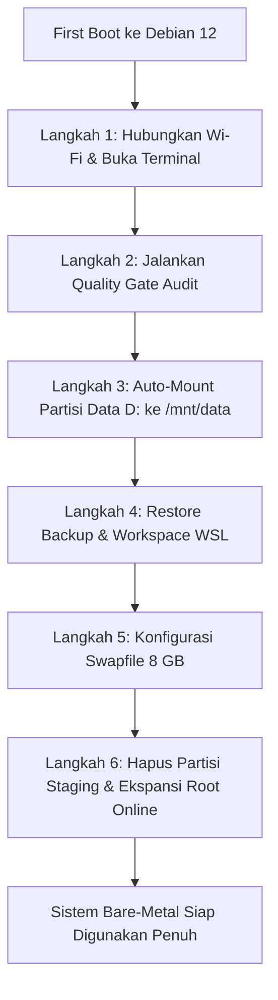

# Panduan Fase 4: Protokol Pasca-Instalasi Bare-Metal Debian 12

Panduan ini berisi instruksi lengkap yang dijalankan setelah komputer pertama kali boot ke **Debian GNU/Linux 12 Bare-Metal (GNOME)** untuk melakukan verifikasi hardware (*Quality Gate*), mengonfigurasi auto-mount partisi data NTFS (`DATA_STORE`), merestore backup konfigurasi & workspace WSL, mengaktifkan swapfile, serta melakukan ekspansi partisi root secara online.

---

## 1. Alur Kerja Pasca-Instalasi



---

## 2. Langkah 1: First Boot, Login & Koneksi Internet

1. Saat GRUB muncul, pilih **Debian GNU/Linux**.
2. Masukkan passphrase enkripsi (jika mengaktifkan LUKS2 saat install), lalu login dengan akun user: **`rizz`**.
3. Di desktop GNOME, klik icon status di pojok kanan atas -> pilih jaringan Wi-Fi Anda dan masukkan password.
4. Buka aplikasi **Terminal** (tekan `Super` / tombol Windows -> ketik `terminal`).

---

## 3. Langkah 2: Audit Hardware & Quality Gate

Jalankan script audit Quality Gate untuk memastikan seluruh komponen hardware Lenovo IdeaPad 3 terdeteksi optimal:

```bash
# Masuk ke folder repo os-manager (atau clone jika belum ada di root)
cd ~/dev/os-manager || cd /mnt/data/dev/os-manager || true

# Jalankan audit Quality Gate
bash scripts/migration/quality_gate_audit.sh
```

### Kriteria Checklist Quality Gate:
* [x] Wi-Fi Intel Wireless-AC 9560 (`iwlwifi`) terhubung dan speed stabil.
* [x] Audio Intel Ice Lake terdeteksi (`pipewire` / `pulseaudio`).
* [x] Akselerasi grafis Intel UHD Graphics (`i915` Mesa 3D) aktif.
* [x] Touchpad gestures GNOME Wayland berfungsi mulus.
* [x] Suspend & Resume (tutup dan buka layar laptop) berjalan normal tanpa freeze.

---

## 4. Langkah 3: Konfigurasi Auto-Mount Partisi Data 201 GB (`DATA_STORE`)

Konfigurasikan partisi 4 (Drive D: NTFS ~244 GB berisi 201 GB data) agar otomatis di-mount ke `/mnt/data` saat sistem menyala dengan permission penuh untuk user `rizz`:

```bash
# 1. Buat direktori mount point
sudo mkdir -p /mnt/data

# 2. Dapatkan UUID dari partisi 4 (DATA_STORE)
UUID_DATA=$(sudo blkid -s UUID -o value /dev/nvme0n1p4)
echo "UUID Partisi Data: ${UUID_DATA}"

# 3. Pasang driver NTFS read-write
sudo apt update && sudo apt install -y ntfs-3g

# 4. Daftarkan ke /etc/fstab secara permanen
if ! grep -q "$UUID_DATA" /etc/fstab; then
    echo "UUID=${UUID_DATA}  /mnt/data  ntfs-3g  defaults,uid=1000,gid=1000,umask=022,nofail  0  0" | sudo tee -a /etc/fstab
fi

# 5. Terapkan mount
sudo mount -a

# 6. Verifikasi isi partisi data
ls -la /mnt/data
```

---

## 5. Langkah 4: Restore Backup Konfigurasi & Workspace WSL

Restore seluruh file dotfiles, SSH keys, git config, dan project runtime dari arsip backup di partisi data:

```bash
# 1. Jalankan script restore otomatis
bash /mnt/data/dev/os-manager/scripts/migration/restore_wsl_home.sh /mnt/data/wsl_backup/wsl_home_backup.tar.gz

# Atau restore manual jika diperlukan:
# tar -xzvf /mnt/data/wsl_backup/wsl_home_backup.tar.gz -C ~/

# 2. Verifikasi kepemilikan file
sudo chown -R rizz:rizz ~/

# 3. Reload konfigurasi shell
source ~/.bashrc 2>/dev/null || true
```

---

## 6. Langkah 5: Pembuatan Swapfile Dinamis (8 GB)

Untuk performa multitasking optimal pada RAM 8 GB:

```bash
# 1. Alokasikan file swap 8 GB
sudo fallocate -l 8G /swapfile
sudo chmod 600 /swapfile

# 2. Format dan aktifkan swap
sudo mkswap /swapfile
sudo swapon /swapfile

# 3. Daftarkan permanen ke fstab
if ! grep -q "/swapfile" /etc/fstab; then
    echo '/swapfile none swap sw 0 0' | sudo tee -a /etc/fstab
fi

# 4. Verifikasi status swap
free -h
```

---

## 7. Langkah 6: Pembersihan Partisi Transisi & Ekspansi Root Zero-USB (~235 GB)

Setelah sistem Debian bare-metal berjalan stabil dan lolos Quality Gate, bersihkan partisi eks-Windows C:, eks-DEBIAN_SET, dan recovery untuk menggabungkan seluruh ruang menjadi satu partisi root **~235 GB ext4** secara **100% Zero-USB**:

```bash
# 1. Jalankan simulasi Dry-Run
cd ~/dev/os-manager
./scripts/migration/zero_usb_root_relocate.sh --dry-run

# 2. Jalankan relokasi & staging otomasi One-Shot
sudo ./scripts/migration/zero_usb_root_relocate.sh

# 3. Reboot laptop untuk finalisasi ekspansi otomatis
sudo reboot

# 4. Verifikasi kapasitas root yang baru (~235 GB)
df -hT /
```

Detail teknis lengkap dapat dibaca di: [`docs/migration/ZERO_USB_ROOT_EXPANSION_PROTOCOL.md`](ZERO_USB_ROOT_EXPANSION_PROTOCOL.md).

---

## 8. Panduan Membuka Antigravity / AI Coding di Debian Native

Setelah lingkungan desktop dan workspace ter-restore:
1. **Google Antigravity IDE:** Download dan jalankan AppImage / installer Linux Antigravity IDE atau install Antigravity CLI (`agy`).
2. **Claude Code / Node / UV:**
   ```bash
   # Jalankan kembali tool os-manager
   cd ~/dev/os-manager
   osm check
   ```
3. Semua project, SSH keys, dotfiles, dan repository di `/mnt/data/` langsung siap digunakan seperti sedia kala!
