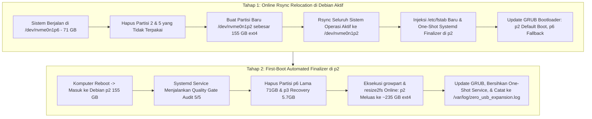

# Protokol Zero-USB: Reklamasi & Ekspansi Partisi Root Debian (~235 GB)

Dokumen ini menjelaskan arsitektur teknis dan prosedur komprehensif untuk mereklamasi partisi sisa transisi (**Partisi 2 Windows C:** ~140 GB, **Partisi 5 Staging Installer:** ~15 GB, dan **Partisi 3 Recovery:** ~5.7 GB) dan memperluas partisi root Debian menjadi satu partisi **~235 GB ext4 utuh** secara **100% Zero-USB** tanpa menggunakan media eksternal (USB flashdrive/CD).

---

## 1. Prinsip Arsitektur Zero-USB



---

## 2. Peta Transformasi Struktur Partisi SSD NVMe 512 GB

### Kondisi Saat Ini (Post-Phase 3 Install):
```text
Total Storage: 512 GB (NVMe SSD SSSTC CL1-4D512)
┌────────────┬──────────────────┬─────────────────┬───────────────────┬──────────────┬────────────────────────┐
│ Partisi 1  │ Partisi 2        │ Partisi 5       │ Partisi 6         │ Partisi 3    │ Partisi 4: DATA_STORE  │
│ 100 MB     │ 140 GB (NTFS)    │ 15 GB (FAT32)   │ 71 GB (ext4)      │ 5.7 GB (NTFS)│ 244.1 GB (NTFS)        │
│ /boot/efi  │ Eks Windows C:   │ Eks DEBIAN_SET  │ Debian Root Aktif │ Recovery     │ Data Utuh (201 GB Used)│
│ (PROTECTED)│ (DISPOSABLE)     │ (DISPOSABLE)    │ (CURRENT ROOT)    │ (DISPOSABLE) │ (STRICT PROTECTED)     │
└────────────┴──────────────────┴─────────────────┴───────────────────┴──────────────┴────────────────────────┘
```

### Kondisi Target Akhir (Setelah Otomasi Zero-USB Selesai):
```text
┌─────────────────┬───────────────────────────────────────────┬────────────────────────────────────────┐
│ Partisi 1       │ Partisi 2: Debian Root Utama              │ Partisi 4: DATA_STORE                  │
│ 100 MB (FAT32)  │ ~230 - 235 GB (ext4)                      │ 244.1 GB (NTFS)                        │
│ Mount:          │ Mount:                                    │ Mount:                                 │
│ /boot/efi       │ / (Debian GNOME Wayland Native)           │ /mnt/data (201 GB Data Pribadi Utuh)   │
└─────────────────┴───────────────────────────────────────────┴────────────────────────────────────────┘
```

---

## 3. Aturan Keselamatan (*Zero-Data-Loss Guardrail*)

1. ⛔ **Partisi 4 (`DATA_STORE` ~244.1 GB NTFS / UUID `6C7AB7E37AB7A7EA`)**:
   * **DILARANG KERAS** disentuh, dihapus, atau diformat.
   * Skrip memvalidasi UUID sebelum dan sesudah eksekusi untuk memastikan integritas 201 GB data.
2. ⛔ **Partisi 1 (`EFI ESP` 100 MB FAT32)**:
   * Terlindungi secara permanen untuk melayani GRUB bootloader.
3. 🛡️ **Failsafe Rollback**:
   * Partisi root lama `p6` (71 GB) tetap utuh selama proses rsync dan baru dihapus saat `p2` telah terbukti sukses booting dan lolos Quality Gate.

---

## 4. Panduan Eksekusi Otomasi

### Langkah 1: Simulasi Dry-Run
Jalankan simulasi tanpa modifikasi disk untuk memverifikasi alur:
```bash
cd ~/dev/os-manager
./scripts/migration/zero_usb_root_relocate.sh --dry-run
```

### Langkah 2: Eksekusi Relokasi Online
Jalankan eksekusi relokasi dengan hak akses root:
```bash
sudo ./scripts/migration/zero_usb_root_relocate.sh
```

### Langkah 3: Reboot ke Sistem Baru
Setelah skrip selesai, restart laptop:
```bash
sudo reboot
```

### Langkah 4: Verifikasi Hasil Akhir
Setelah masuk kembali ke desktop Debian:
1. Periksa kapasitas partisi root:
   ```bash
   df -hT /
   ```
   *Kapasitas root akan menunjukkan **~235 GB ext4**.*

2. Periksa log finalisasi otomatis:
   ```bash
   cat /var/log/zero_usb_expansion.log
   ```
