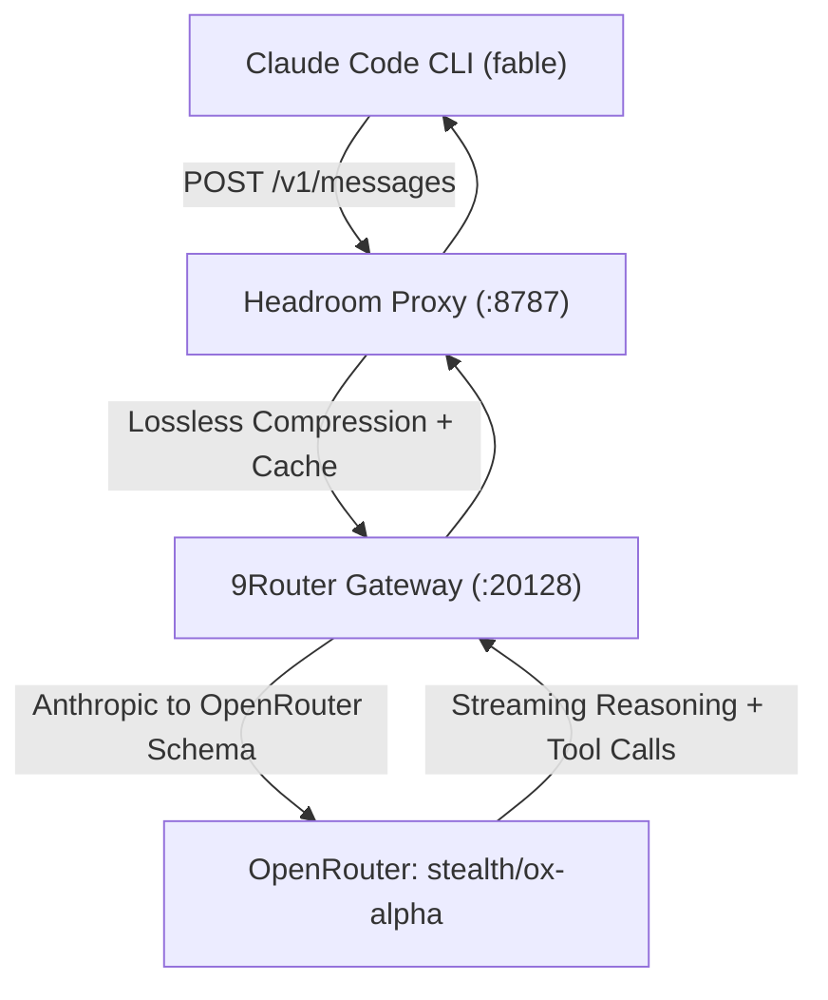

# Test & Benchmark Plan: 9Router Model ox-alpha for Claude Code (Pure TypeScript Async Engine)

> **For agentic workers:** REQUIRED SUB-SKILL: Use superpowers:subagent-driven-development or superpowers:executing-plans to implement/execute this verification and testing plan. Steps use checkbox (`- [ ]`) syntax for tracking.

**Goal:** Menguji performa penalaran (*reasoning*), tool calling (*file manipulation & command execution*), dan resiliensi model `ox-alpha` (`openrouter/stealth/ox-alpha`) pada Claude Code CLI melalui skenario pengujian berat yang identik (*Pure TypeScript Async Stream Engine* dengan metodologi SDD $\times$ TDD $\times$ Subagent-DD).

**Architecture:** Aliran data terpadu: `Claude Code CLI (fable)` $\rightarrow$ `Headroom Proxy (:8787)` $\rightarrow$ `9Router Gateway (:20128)` $\rightarrow$ `OpenRouter (stealth/ox-alpha)`.

**Tech Stack:** Claude Code CLI v2.1.241, Headroom Proxy v0.36.5, 9Router Gateway v16.2.1, Node.js v26+, TypeScript v5.7+, Vitest v3.0+.

---

## 1. System Topology & Configuration

### 1.1 Model Mapping (`~/.claude/settings.json`)
* **`ANTHROPIC_DEFAULT_FABLE_MODEL`:** `openrouter/stealth/ox-alpha` (Model Target Benchmark)
* **`ANTHROPIC_DEFAULT_OPUS_MODEL`:** `ag/gemini-3.7-flash-high`
* **`ANTHROPIC_DEFAULT_SONNET_MODEL`:** `ag/gemini-3.7-flash-high`
* **`ANTHROPIC_DEFAULT_HAIKU_MODEL`:** `ag/gemini-3.7-flash-high`
* **`ANTHROPIC_BASE_URL`:** `http://127.0.0.1:8787` (Headroom Context Compression Proxy)



---

## 2. Benchmark Execution Plan

### Task 1: Sandbox Reset & Scaffolding (Opsi 2)

**Files:**
- Directory: `/home/rizz/dev/claude-test/`
- Reset Targets: `src/`, `tests/`, `dist/`, `SPEC.md` (Dibersihkan)
- Preserved Targets: `node_modules/`, `package.json`, `package-lock.json`, `tsconfig.json`, `vitest.config.ts`
- Scaffolding: `PROMPT.md`

- [ ] **Step 1.1: Clean sandbox artifacts in `~/dev/claude-test`**
  - Hapus direktori `src/`, `tests/`, `dist/`, dan file `SPEC.md`.
  - Pastikan dependencies Vitest dan TypeScript di `node_modules` tetap utuh.

- [ ] **Step 1.2: Prepare `PROMPT.md` with SDD x TDD x Subagent-DD Benchmark Mission**
  - Tulis ulang instruksi misi otonom standar:
    1. **Phase 1 (SDD):** Pembuatan `SPEC.md` mencakup arsitektur & tipe generic.
    2. **Phase 2 (TDD):** Penulisan unit tests di `tests/` sebelum implementasi.
    3. **Phase 3 (Modular Implementation):**
       - `src/core/StreamProcessor.ts`
       - `src/events/TypedEventPipeline.ts`
       - `src/ast/ASTMetadataExtractor.ts`
       - `src/mock/MockLoadGenerator.ts`

---

### Task 2: Autonomous Benchmark Execution with `ox-alpha`

**Execution Mode:**
- Sesi `tmux`: `claude-benchmark-ox` atau subprocess background dengan streaming log.
- Model: `--model fable` (memetakan ke `openrouter/stealth/ox-alpha`).

- [ ] **Step 2.1: Launch Claude Code Autonomous Benchmark**
  - Perintah eksekusi:
    ```bash
    cd /home/rizz/dev/claude-test
    claude -p "Please read PROMPT.md in the current directory and execute the mission end-to-end following the SDD x TDD x Subagent-DD workflow. Begin immediately by writing SPEC.md." --model fable
    ```

- [ ] **Step 2.2: Monitor Execution & Tool Calling Behavior**
  - Pantau pembuatan `SPEC.md`, pembuatan file `tests/*.test.ts`, implementasi kode di `src/*.ts`, dan eksekusi `npm test`.

---

### Task 3: Quality Gates & Verification

- [ ] **Step 3.1: Verify Vitest Test Suite Execution**
  - Jalankan `npm test` di `/home/rizz/dev/claude-test/` untuk memvalidasi test coverage dan kelulusan 100%.

- [ ] **Step 3.2: Verify TypeScript Compilation (`tsc --noEmit`)**
  - Pastikan tidak ada kesalahan tipe strict di semua modul yang dihasilkan.

- [ ] **Step 3.3: Verify Headroom Telemetry & Proxy Savings**
  - Periksa `osm ai status --json` dan telemetri `~/.headroom/proxy_savings.json` untuk mencatat jumlah token yang dihemat dan total request yang diproses oleh `ox-alpha`.

---

## 4. Verification Commands

### Automated Test Commands:
```bash
# 1. Verifikasi hasil compile TypeScript
cd /home/rizz/dev/claude-test && npx tsc --noEmit

# 2. Verifikasi unit test Vitest
cd /home/rizz/dev/claude-test && npm test

# 3. Status telemetri AI Proxy
osm ai status --json
```

### Manual Verification:
1. Buka dashboard Headroom: `osm ai dashboard --headroom-only` (`http://127.0.0.1:8787/dashboard`).
2. Periksa file `SPEC.md` dan struktur modul di `/home/rizz/dev/claude-test/src/`.
