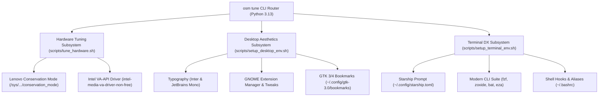

# Debian 13 (Trixie) Desktop & Hardware Customization Design Specification

**Status:** APPROVED  
**Date:** 2026-08-22  
**Author:** Lead Systems Tooling Architect & Desktop Experience Engineer  
**Target Environment:** Bare-Metal Debian GNU/Linux 13 (Trixie), Linux Kernel 6.12+, GNOME 48 (Wayland), Lenovo IdeaPad 3 (81WD) with Intel Ice Lake + NVIDIA MX330  
**Target Plan:** [`docs/superpowers/plans/2026-08-22-debian-13-desktop-and-hardware-customization.md`](file:///home/rizz/dev/os-manager/docs/superpowers/plans/2026-08-22-debian-13-desktop-and-hardware-customization.md)

---

## 1. Executive Summary & Objective

Following the successful in-place distribution upgrade to Debian 13 (Trixie) and Linux Kernel 6.12, the objective of this specification is to establish an automated, idempotent, and test-driven customization suite for:
1. **Hardware Power & Thermal Management:** Automated Lenovo IdeaPad battery conservation mode (60% charging threshold via ACPI kernel module `ideapad_laptop`) and hardware video decoding acceleration (VA-API on Intel Iris Plus Graphics G1).
2. **GNOME 48 Desktop Aesthetics & Workspace Integration:** Native typography integration (Inter & JetBrains Mono), Extension Manager deployment, and persistent GTK 3/4 sidebar bookmarking for `/mnt/data` (*Data Store*).
3. **Modern Terminal & Developer Experience (DX):** Starship cross-shell prompt, fuzzy file/history search (`fzf`), smart directory navigation (`zoxide`), syntax-highlighted paging (`bat`), and modern file listings (`eza`).
4. **CLI Control Plane Integration:** Consolidated management under `osm tune` (`battery`, `vaapi`, `desktop`, `terminal`, `all`) with full JSON telemetry and master harness validation.

---

## 2. Architectural Invariants & Safety Guardrails

| Invariant ID | Name | Architectural Rule |
| :--- | :--- | :--- |
| **INV-01** | **Zero Data Loss on `/mnt/data`** | All operations strictly treat `/dev/nvme0n1p4` (`/mnt/data`) as persistent read/write storage. No partition, format, or mount disruption is permitted. |
| **INV-02** | **Strict Idempotency** | Every script subroutine (`tune_hardware.sh`, `setup_desktop_env.sh`, `setup_terminal_env.sh`) must be safe to run repeatedly without creating duplicate entries in `~/.bashrc`, `~/.config/gtk-3.0/bookmarks`, or system configurations. |
| **INV-03** | **Root vs User Boundary Separation** | System package installations (`apt-get`) and sysfs writes (`/sys/bus/platform/...`) require root/sudo privileges. All user-space dotfiles and desktop configurations (`~/.config/starship.toml`, `~/.bashrc`, `bookmarks`) must be created under the active user's `$HOME` with non-root ownership. |
| **INV-04** | **Hybrid GPU & Wayland Decoupling** | All display rendering and VA-API hardware decoders prioritize Intel Iris Plus Graphics (`i915` / `/dev/dri/card0` / `/dev/dri/renderD128`) on Wayland to maximize battery longevity and eliminate Wayland compositor lockups. |
| **INV-05** | **Offline/Fallback Resilience** | Python CLI subcommands must provide graceful fallbacks (e.g. `uv` fallback when `python3-venv` is missing, warnings on non-Lenovo hardware). |

---

## 3. Subsystem Architecture & Technical Specifications



---

### 3.1 Subsystem 1: Lenovo Hardware Power & VA-API Video Acceleration

#### 1. Lenovo Battery Conservation Mode:
* **Sysfs Path:** `/sys/bus/platform/drivers/ideapad_acpi/VPC2004:00/conservation_mode`
* **Driver:** Kernel module `ideapad_laptop`
* **Behavior:**
  * Writing `1` stops charging when the battery capacity reaches ~60%, preventing battery degradation during continuous AC wall power operation.
  * Writing `0` allows normal 100% full charging.
* **CLI Interface:** `osm tune battery [status|on|off]`

#### 2. Intel VA-API Hardware Video Decoding:
* **Target Hardware:** Intel Core i5-1035G1 (Intel Iris Plus Graphics G1 / Ice Lake)
* **Required Packages:** `intel-media-va-driver-non-free`, `vainfo`, `i965-va-driver-shaders`
* **Verification Command:** `vainfo` inspecting `VAProfileH264Main`, `VAProfileHEVCMain`, `VAProfileVP9Profile0` for `VAEntrypointVLD`.
* **CLI Interface:** `osm tune vaapi [status|install]`

---

### 3.2 Subsystem 2: GNOME 48 Desktop Aesthetics & Nautilus Integration

#### 1. Modern Typography:
* **UI Font:** `fonts-inter` (clean, modern interface font optimized for high-DPI screens).
* **Monospace / Terminal Font:** `fonts-jetbrains-mono` (high-readability programming font with ligatures and coding symbols).

#### 2. Nautilus Data Store Bookmarking:
* **Target File:** `${HOME}/.config/gtk-3.0/bookmarks`
* **Format:** `file:///mnt/data Data Store`
* **Verification:** Idempotent lookup using `grep -qF "file:///mnt/data"` before appending.

#### 3. Desktop Tweaks & Extension Infrastructure:
* **Packages:** `gnome-shell-extension-manager`, `gnome-tweaks`
* **Target GNOME 48 Extensions:**
  * *Blur my Shell* (frosted-glass translucency on Wayland top panel & overview).
  * *AppIndicator Support* (tray icons in top bar).
  * *Just Perfection* (fine-grained GNOME 48 UI control).
  * *Clipboard Indicator* (top-bar clipboard manager).

---

### 3.3 Subsystem 3: Modern Terminal & Developer Experience (DX)

#### 1. Starship Prompt Engine:
* **Configuration:** `${HOME}/.config/starship.toml`
* **Prompt Format:** Directory truncation (`3`), Git branch & status styling, Python virtual environment detection, and execution status symbol (`❯`).
* **Installation:** Idempotent check for `starship` binary; downloads official prebuilt binary if uninstalled.

#### 2. Modern CLI Utilities:
* **`fzf`:** Interactive fuzzy-finder for reverse command search (`Ctrl+R`) and file completion (`Ctrl+T`).
* **`zoxide`:** Smart directory jumper with frecency algorithm (`alias cd="z"`).
* **`bat` (`batcat`):** Cat clone with syntax highlighting and Git integration (`alias cat="bat --paging=never"`).
* **`eza`:** Modern replacement for `ls` with icons, file metadata, and directory-first sorting (`alias ls="eza --icons"`).

#### 3. Shell Hook Idempotency:
* Configuration block encapsulated within a distinctive marker:
  ```bash
  # --- os-manager Terminal Power-Up Hooks ---
  ```

---

## 4. CLI Control Plane Interface Specification

The `osm tune` command group provides unified access to all customization features:

```bash
# Audit all hardware power, media, and environment tuning
osm tune audit

# Manage Lenovo battery conservation mode
osm tune battery status
osm tune battery on
osm tune battery off

# Inspect and install VA-API video decoding acceleration
osm tune vaapi status
osm tune vaapi install

# Configure GNOME typography, bookmarks, and tweaks
osm tune desktop

# Configure Starship prompt, fzf, zoxide, and modern CLI tools
osm tune terminal

# Run all customization subroutines end-to-end
osm tune all
```

---

## 5. Verification & Testing Matrix

| Test Suite | Scope | Target Assertions |
| :--- | :--- | :--- |
| `tests/test_tune_hardware.py` | Python unit tests for battery sysfs reading/writing, VA-API detection, and CLI argument parsing. | • Mock sysfs read `1` $\rightarrow$ `enabled`<br/>• Mock sysfs read `0` $\rightarrow$ `disabled`<br/>• Non-existent path $\rightarrow$ `unsupported`<br/>• `set_battery_conservation_mode` invokes `tee`<br/>• `audit_vaapi_acceleration` parses vainfo output |
| `tests/test_desktop_customization.py` | Python unit tests for GTK 3 bookmark idempotency and Nautilus integration. | • Fresh bookmark creation writes `file:///mnt/data Data Store`<br/>• Subsequent calls do not duplicate entries<br/>• Respects custom bookmark path overrides |
| `tests/test_terminal_customization.py` | Python unit tests for Starship configuration generation and `.bashrc` alias injection. | • TOML configuration contains directory, git, and python modules<br/>• `.bashrc` alias injection includes marker and hooks<br/>• Re-running is strictly idempotent |
| `tests/test_harness.sh` | Master regression test suite integration. | • All new unit suites pass with exit code 0<br/>• Zero hardcoded path leaks<br/>• 100% clean harness execution |

---

## 6. Execution & Rollout Plan

1. Implement Task 1: Lenovo Hardware Power Tuning & VA-API Video Acceleration Engine ([`scripts/tune_hardware.sh`](file:///home/rizz/dev/os-manager/scripts/tune_hardware.sh)).
2. Implement Task 2: GNOME 48 Desktop Aesthetics & Nautilus Data Store Bookmarking ([`scripts/setup_desktop_env.sh`](file:///home/rizz/dev/os-manager/scripts/setup_desktop_env.sh)).
3. Implement Task 3: Modern Terminal & Developer Experience Suite ([`scripts/setup_terminal_env.sh`](file:///home/rizz/dev/os-manager/scripts/setup_terminal_env.sh)).
4. Implement Task 4: CLI Router Integration (`osm tune`), Master Harness Registration, and Documentation Guide ([`docs/DEBIAN_13_CUSTOMIZATION_GUIDE.md`](file:///home/rizz/dev/os-manager/docs/DEBIAN_13_CUSTOMIZATION_GUIDE.md)).
