# Debian 13 (Trixie) Desktop & Hardware Customization Design Specification

**Status:** APPROVED  
**Date:** 2026-08-22  
**Author:** Lead Systems Tooling Architect & Desktop Experience Engineer  
**Target Environment:** Bare-Metal Debian GNU/Linux 13 (Trixie), Linux Kernel 6.12+, GNOME 48 (Wayland), Lenovo IdeaPad 3 (81WD) with Intel Ice Lake (i5-1035G1) + NVIDIA GeForce MX330  
**Target Plan:** [`docs/superpowers/plans/2026-08-22-debian-13-desktop-and-hardware-customization.md`](file:///home/rizz/dev/os-manager/docs/superpowers/plans/2026-08-22-debian-13-desktop-and-hardware-customization.md)

---

## 1. Executive Summary & Objective

Following the successful in-place distribution upgrade to Debian 13 (Trixie) and Linux Kernel 6.12, the objective of this specification is to establish an automated, idempotent, and test-driven customization suite for:
1. **Hardware Power, Thermals & Hybrid Graphics Management:** Automated Lenovo IdeaPad battery conservation mode (60% charging threshold via ACPI `ideapad_laptop`), ACPI platform thermal profiles (`Fn+Q`), Fn-Lock control, Intel Ice Lake proactive thermal management (`thermald`), NVIDIA MX330 PCIe Runtime D3 Cold power-gating, Intel Iris Plus VA-API video decoding acceleration, and persistent `systemd` boot restoration.
2. **System Kernel, Storage, Audio & Security Hardening:** Kernel performance sysctl tuning (`vm.swappiness=10`, `fs.inotify.max_user_watches=524288`, TCP BBR congestion control), NVMe SSD periodic maintenance (`fstrim.timer`), PipeWire & Bluetooth high-bitrate audio codecs (`pipewire-audio`, `wireplumber`), host firewall (`ufw`), and modern APT package management (`nala`).
3. **GNOME 48 Desktop Aesthetics, Ergonomics & Developer Workflow:** Native typography integration (Inter & JetBrains Mono), subpixel font rendering, window management ergonomics (minimize/maximize, centered placement, window-based Alt+Tab), full dark theme & night light schedule, touchpad gestures/tap-to-click tuning, audio over-amplification, Nautilus list-view & terminal integration, Extension Manager deployment, and declarative `dconf` desktop state backup/restore.
4. **Modern Terminal & Developer Experience (DX):** Modern Rust/Go CLI suite (`ripgrep`, `fd`, `bat`, `eza`, `fzf`, `zoxide`, `btop`, `duf`), Starship cross-shell prompt, FZF live syntax previews, Bash 5.2+ sensible defaults & infinite timestamped history, Git power shortcuts, and a preconfigured `tmux` developer profile.
5. **CLI Control Plane Integration:** Consolidated management under `osm tune` (`battery`, `profile`, `fn-lock`, `thermals`, `gpu`, `vaapi`, `hardware-persist`, `system`, `desktop`, `terminal`, `all`) with full JSON telemetry and master harness validation.

---

## 2. Architectural Invariants & Safety Guardrails

| Invariant ID | Name | Architectural Rule |
| :--- | :--- | :--- |
| **INV-01** | **Zero Data Loss on `/mnt/data`** | All operations strictly treat `/dev/nvme0n1p4` (`/mnt/data`) as persistent read/write storage. No partition, format, or mount disruption is permitted. |
| **INV-02** | **Strict Idempotency** | Every script subroutine (`tune_hardware.sh`, `tune_system.sh`, `setup_desktop_env.sh`, `setup_terminal_env.sh`) must be safe to run repeatedly without creating duplicate entries in `~/.bashrc`, `~/.config/gtk-3.0/bookmarks`, `~/.tmux.conf`, `/etc/sysctl.d/`, or system configurations. |
| **INV-03** | **Root vs User Boundary Separation** | System package installations (`apt-get`), daemon management (`systemd`), firewall rules (`ufw`), and sysfs/sysctl writes require root/sudo privileges. All user-space dotfiles and desktop configurations (`~/.config/starship.toml`, `~/.bashrc`, `~/.tmux.conf`, `bookmarks`, `gsettings`, `dconf`) must be executed under the active user's `$HOME` with non-root ownership. |
| **INV-04** | **Hybrid GPU & Wayland Decoupling** | All display rendering and VA-API hardware decoders prioritize Intel Iris Plus Graphics (`i915` / `/dev/dri/card0` / `/dev/dri/renderD128`) on Wayland. The discrete NVIDIA MX330 is power-gated into Runtime D3 Cold (`suspended`) when idle. |
| **INV-05** | **Offline/Fallback Resilience** | Python CLI subcommands must provide graceful fallbacks (e.g. headless/no D-Bus detection for `gsettings`, `uv` fallback when `python3-venv` is missing, warnings on non-Lenovo hardware). |

---

## 3. Subsystem Architecture & Technical Specifications

```mermaid
flowchart TD
    CLI["osm tune CLI Router (Python 3.13)"] --> SUB1["Hardware, Power & GPU Subsystem (scripts/tune_hardware.sh)"]
    CLI --> SUB2["Kernel, Storage & Security Subsystem (scripts/tune_system.sh)"]
    CLI --> SUB3["Desktop Aesthetics & Ergonomics Subsystem (scripts/setup_desktop_env.sh)"]
    CLI --> SUB4["Terminal DX Subsystem (scripts/setup_terminal_env.sh)"]

    SUB1 --> ACPI["Lenovo ACPI (Conservation Mode, Fn+Q Profile, Fn-Lock)"]
    SUB1 --> THERMAL["Intel Ice Lake Thermals (thermald & intel_pstate EPP)"]
    SUB1 --> GPU["NVIDIA MX330 Power-Gating (Runtime D3 Cold / Suspended)"]
    SUB1 --> VAAPI["Intel VA-API Driver (intel-media-va-driver-non-free)"]
    SUB1 --> PERSIST["Boot Persistence Service (osm-hardware-tune.service)"]

    SUB2 --> SYSCTL["Kernel Sysctl (swappiness=10, inotify, TCP BBR)"]
    SUB2 --> TRIM["NVMe Storage Maintenance (fstrim.timer)"]
    SUB2 --> AUDIO["PipeWire & Bluetooth High-Bitrate Codecs"]
    SUB2 --> SEC["UFW Firewall (deny in, allow out, SSH guard)"]
    SUB2 --> NALA["Modern Package Management (Nala)"]

    SUB3 --> FONTS["Typography (Inter & JetBrains Mono) + Subpixel Rendering"]
    SUB3 --> THEME["Dark Mode + Accent + Night Light + Window Ergonomics"]
    SUB3 --> TOUCHPAD["Touchpad (Tap-to-click, Natural Scroll) + Audio Boost"]
    SUB3 --> NAUTILUS["Nautilus List View + Bookmarks + Terminal Menu"]
    SUB3 --> EXT["GNOME Extensions + Declarative dconf Backup/Restore"]

    SUB4 --> CLI_TOOLS["Modern Toolchain (rg, fd, bat, eza, fzf, zoxide, btop, duf)"]
    SUB4 --> STARSHIP["Starship Prompt (~/.config/starship.toml)"]
    SUB4 --> FZF_PREVIEW["FZF Live Previews (bat & eza integrations)"]
    SUB4 --> BASHRC["Bash 5.2+ Defaults, Infinite History & Aliases (~/.bashrc)"]
    SUB4 --> TMUX["Tmux Developer Starter Profile (~/.tmux.conf)"]
```



---

### 3.1 Subsystem 1: Lenovo Hardware Power, Thermals & Hybrid Graphics Management

#### 1. Lenovo Battery Conservation Mode:
* **Sysfs Path:** `/sys/bus/platform/drivers/ideapad_acpi/VPC2004:00/conservation_mode`
* **Driver:** Kernel module `ideapad_laptop`
* **Behavior:**
  * Writing `1` stops charging when the battery capacity reaches ~60%, preventing battery degradation during continuous AC wall power operation.
  * Writing `0` allows normal 100% full charging.
* **CLI Interface:** `osm tune battery [status|on|off]`

#### 2. Lenovo Platform Profiles (`Fn+Q` Thermal Modes):
* **Sysfs Interface:** `/sys/firmware/acpi/platform_profile`
* **Supported Modes:** Read from `/sys/firmware/acpi/platform_profile_choices`:
  * `low-power` (Quiet mode: reduced CPU TDP, silent fan profile, extended battery longevity).
  * `balanced` (Intelligent cooling: dynamic thermal throttling and fan curves).
  * `performance` (Extreme performance: maximum CPU boost power limits).
* **CLI Interface:** `osm tune profile [status|quiet|balanced|performance]`

#### 3. Lenovo Fn-Lock Control:
* **Sysfs Path:** `/sys/bus/platform/drivers/ideapad_acpi/VPC2004:00/fn_lock`
* **Behavior:**
  * Writing `1` restores standard F1–F12 function key behavior.
  * Writing `0` configures keys as multimedia action shortcuts (volume, brightness, etc.).
* **CLI Interface:** `osm tune fn-lock [status|on|off]`

#### 4. Intel Ice Lake Proactive Thermal Management:
* **Thermal Daemon:** Deploy and enable `thermald` (Intel Dynamic Platform and Thermal Framework for Linux) to eliminate CPU thermal throttling spikes on Intel Ice Lake 10nm.
* **CPU Energy Performance Preference (EPP):**
  * Utilize `intel_pstate` scaling governor (`powersave`).
  * Dynamic EPP Policy: `balance_performance` on AC mains, `balance_power` on battery.
* **CLI Interface:** `osm tune thermals [status|install]`

#### 5. Hybrid GPU Power-Gating (NVIDIA GeForce MX330):
* **Target Hardware:** NVIDIA GeForce MX330 (PCI `0000:01:00.0`, GP108 architecture).
* **Power Management Policy:**
  * GNOME 48 Wayland compositor runs exclusively on Intel Iris Plus Graphics (`i915`).
  * Enforce PCIe Runtime Power Management (`/sys/bus/pci/devices/0000:01:00.0/power/control` $\rightarrow$ `auto`).
  * Verify discrete GPU drops into **Runtime D3 Cold (`suspended`)** when idle (0W power draw).
* **CLI Interface:** `osm tune gpu [status|power-save]`

#### 6. Intel Iris Plus VA-API Hardware Video Decoding:
* **Target Hardware:** Intel Core i5-1035G1 (Intel Iris Plus Graphics G1 / Ice Lake)
* **Required Packages:** `intel-media-va-driver-non-free`, `vainfo`, `i965-va-driver-shaders`
* **Verification Command:** `vainfo` inspecting `VAProfileH264Main`, `VAProfileHEVCMain`, `VAProfileVP9Profile0` for `VAEntrypointVLD`.
* **CLI Interface:** `osm tune vaapi [status|install]`

#### 7. Boot Persistence Service (`systemd`):
* **Configuration File:** `/etc/osm/hardware-tune.conf`
  ```ini
  [hardware]
  conservation_mode=1
  platform_profile=balanced
  fn_lock=1
  gpu_power_save=1
  ```
* **Systemd Unit File:** `/etc/systemd/system/osm-hardware-tune.service`
  * Automatically invokes `scripts/tune_hardware.sh --apply-config` upon boot to guarantee persistent hardware settings across reboots.
* **CLI Interface:** `osm tune hardware-persist [status|enable|disable]`

---

### 3.2 Subsystem 2: System Kernel, Storage, Audio & Security Hardening

#### 1. Kernel Sysctl Performance Tuning:
* **Target File:** `/etc/sysctl.d/99-osm-performance.conf`
* **Parameters Applied:**
  ```ini
  # Prioritize RAM retention for active applications, minimizing aggressive disk swapping
  vm.swappiness = 10
  vm.vfs_cache_pressure = 50

  # Expand file watching descriptor limit for modern IDEs & development servers (VS Code, JetBrains, Docker)
  fs.inotify.max_user_watches = 524288
  fs.inotify.max_user_instances = 1024

  # Mitigate I/O stuttering during heavy disk writes
  vm.dirty_background_ratio = 5
  vm.dirty_ratio = 10

  # Enable TCP BBR congestion control for optimal network throughput and lower latency
  net.core.default_qdisc = fq
  net.ipv4.tcp_congestion_control = bbr
  ```
* **Verification Command:** `sysctl --system` and verifying `sysctl net.ipv4.tcp_congestion_control`.

#### 2. NVMe SSD Health & Periodic Maintenance:
* **Target Storage:** `/dev/nvme0n1` (Crucial/Micron NVMe SSD hosting root `/` and `/mnt/data`).
* **Maintenance Strategy:**
  * Avoid continuous synchronous `discard` mounts in `/etc/fstab` which degrade real-time I/O performance.
  * Enable and verify the asynchronous weekly TRIM systemd timer:
    `systemctl enable --now fstrim.timer`

#### 3. PipeWire Audio & Bluetooth Codec Stack:
* **System Packages:** `pipewire-audio`, `wireplumber`, `libspa-0.2-bluetooth`, `bluez`
* **Enhancements:**
  * Ensure WirePlumber is active as the default session manager for PipeWire.
  * Enable high-bitrate Bluetooth codecs (`SBC-XQ`, `LDAC`) for wireless development headsets.

#### 4. Host Security & Firewall Hardening:
* **System Package:** `ufw`
* **Configuration:**
  * `ufw default deny incoming`
  * `ufw default allow outgoing`
  * `ufw allow 22/tcp` (Ensure SSH access is preserved if remote access is required)
  * `ufw enable`

#### 5. Modern Package Management Ergonomics:
* **System Package:** `nala`
* **Features:** Parallel package downloads, clean visual transaction diffs, and historical transaction undo (`nala history undo`).

---

### 3.3 Subsystem 3: GNOME 48 Desktop Aesthetics, Ergonomics & Developer Workflow

#### 1. Modern Typography & Subpixel Font Rendering:
* **System Packages:** `fonts-inter`, `fonts-jetbrains-mono`
* **Applied GSettings Configurations:**
  * UI Interface Font: `org.gnome.desktop.interface font-name 'Inter 10.5'`
  * Document Font: `org.gnome.desktop.interface document-font-name 'Inter 11'`
  * Monospace / Code Font: `org.gnome.desktop.interface monospace-font-name 'JetBrains Mono 10'`
  * Text Sharpness (1080p LCD): `org.gnome.desktop.interface font-antialiasing 'rgba'`
  * Subpixel Hinting: `org.gnome.desktop.interface font-hinting 'slight'`

#### 2. Window Management, Dark Theme & Ergonomics:
* **Window Controls:** Enable minimize, maximize, and close buttons on all windows:
  * `org.gnome.desktop.wm.preferences button-layout 'appmenu:minimize,maximize,close'`
* **Window Placement:** Automatically center newly spawned application windows:
  * `org.gnome.mutter center-new-windows true`
* **Dark Mode & Eye Comfort:**
  * Global Dark Theme: `org.gnome.desktop.interface color-scheme 'prefer-dark'`
  * Legacy GTK Theme: `org.gnome.desktop.interface gtk-theme 'Adwaita-dark'`
  * Automatic Night Light (Sunset to Sunrise): `org.gnome.settings-daemon.plugins.color night-light-enabled true`
* **Developer Window Switching:** Switch directly between distinct windows instead of grouped applications:
  * `org.gnome.desktop.wm.keybindings switch-applications "[]"`
  * `org.gnome.desktop.wm.keybindings switch-windows "['<Alt>Tab']"`

#### 3. Lenovo Laptop Touchpad & Audio Amplification Tuning:
* **Touchpad Peripherals (`gsettings`):**
  * Tap-to-Click (1 finger = left click, 2 fingers = right click): `org.gnome.desktop.peripherals.touchpad tap-to-click true`
  * Two-Finger Natural Scrolling: `org.gnome.desktop.peripherals.touchpad natural-scroll true`
  * Palm / Typing Rejection: `org.gnome.desktop.peripherals.touchpad disable-while-typing true`
* **Audio Over-Amplification:**
  * Boost speaker output volume beyond 100% (up to 150%) for clear video calls and media: `org.gnome.desktop.sound allow-volume-above-100-percent true`

#### 4. Nautilus Developer Ergonomics & Data Store Bookmark:
* **Data Store Sidebar Bookmark:**
  * Target File: `${HOME}/.config/gtk-3.0/bookmarks`
  * Format: `file:///mnt/data Data Store`
  * Verification: Idempotent lookup using `grep -qF "file:///mnt/data"` before appending.
* **Developer View Settings:**
  * Default Folder Viewer: `org.gnome.nautilus.preferences default-folder-viewer 'list-view'`
  * Detailed Timestamp Format: `org.gnome.nautilus.preferences date-time-format 'detailed'`
* **Terminal Context Integration:**
  * System Package: `nautilus-extension-gnome-terminal` (enables right-click *"Open in Terminal"*).

#### 5. GNOME Extensions Ecosystem & Declarative Dconf State Management:
* **System Packages:** `gnome-shell-extension-manager`, `gnome-tweaks`, `gnome-shell-extension-appindicator`, `dconf-cli`
* **Curated Top Extensions:**
  * *AppIndicator Support* (Tray icons in top panel for developer tools).
  * *Blur my Shell* (Frosted-glass translucency on Wayland top panel & overview).
  * *Just Perfection* (Fine-grained GNOME 48 panel and animation customization).
  * *Clipboard Indicator* (Top-bar persistent clipboard history manager).
  * *Vitals* (Real-time CPU, RAM, temperature, and fan speed telemetry in top bar).
* **Declarative Desktop Profiles (`dconf` Export/Import):**
  * Target File: `${HOME}/.config/dconf/gnome-desktop.ini`
  * `osm tune desktop backup [filepath]` $\rightarrow$ Exports current `/org/gnome/` settings via `dconf dump`.
  * `osm tune desktop restore [filepath]` $\rightarrow$ Restores `/org/gnome/` settings via `dconf load`.

---

### 3.4 Subsystem 4: Modern Terminal & Ultimate Developer Experience (DX)

#### 1. Modern CLI Suite (The Modern Unix Toolchain):
* **Target Packages & Binaries:**
  * `ripgrep` (`rg`): Blazingly fast multi-threaded regex search respecting `.gitignore`.
  * `fd-find` (`fd`): Fast, intuitive filesystem search alternative to `find`.
  * `bat` (`batcat`): `cat` clone with syntax highlighting and Git gutter integration.
  * `eza`: Modern `ls` replacement with Nerd font icons, metadata, and Git status.
  * `fzf`: General-purpose command-line fuzzy finder.
  * `zoxide` (`z`): Smarter directory jumper with learning frecency algorithm.
  * `btop`: Interactive visual process and resource monitor (CPU, RAM, GPU, Disks).
  * `duf`: User-friendly, colorful disk usage utility.
  * `tmux`: Terminal multiplexer with custom developer profile.

#### 2. Starship Prompt Engine:
* **Configuration:** `${HOME}/.config/starship.toml`
* **Prompt Format:**
  * Directory truncation (`3`), path icons, and git repository root detection.
  * Git branch name, dirty state indicators, stash count, ahead/behind sync status.
  * Runtime indicators: Python virtual environment (`.venv`), Node.js, Rust/Cargo, Docker context.
  * Execution duration counter for long-running commands (> 2 seconds).
  * Execution status symbol: `❯` (green on success, red on non-zero exit code).

#### 3. FZF Live Preview & Interactive Keybindings:
* **Shell Environment Setup (`~/.bashrc`):**
  * `FZF_DEFAULT_COMMAND='fd --type f --strip-cwd-prefix --hidden --exclude .git'`
  * `FZF_CTRL_T_COMMAND="$FZF_DEFAULT_COMMAND"`
  * `FZF_ALT_C_COMMAND='fd --type d --strip-cwd-prefix --hidden --exclude .git'`
  * `FZF_CTRL_T_OPTS="--preview 'bat --style=numbers --color=always --line-range :500 {}' --preview-window=right:60%:wrap"`
  * `FZF_ALT_C_OPTS="--preview 'eza --tree --level=2 --color=always {}' --preview-window=right:50%"`
  * `FZF_CTRL_R_OPTS="--preview 'echo {}' --preview-window=down:3:wrap --sort"`

#### 4. Bash 5.2+ Sensible Defaults & Infinite History:
* **History Management:**
  * `HISTSIZE=100000`
  * `HISTFILESIZE=200000`
  * `HISTCONTROL=ignoreboth:erasedups`
  * `HISTTIMEFORMAT="%F %T "`
* **Shell Ergonomics (`shopt`):**
  * `shopt -s histappend` (append to history file, preventing multi-terminal overwrites).
  * `shopt -s checkwinsize` (auto-update terminal geometry on window resize).
  * `shopt -s globstar` (recursive `**` glob pattern support).
  * `shopt -s cdspell` (autocorrect minor typing errors in directory paths).

#### 5. Modern Unix & Git Developer Aliases:
* **Modern CLI Aliases:**
  ```bash
  alias ls="eza --icons"
  alias ll="eza -lh --icons --git"
  alias la="eza -lah --icons --git"
  alias lt="eza --tree --level=2 --icons"
  alias cat="bat --paging=never"
  alias grep="rg"
  alias find="fd"
  alias df="duf"
  alias top="btop"
  alias cd="z"
  ```
* **Git Power Aliases:**
  ```bash
  alias gst="git status"
  alias gdiff="git diff"
  alias glog="git log --oneline --graph --decorate"
  alias gco="git checkout"
  alias gbr="git branch"
  alias gadd="git add"
  alias gcm="git commit -m"
  ```

#### 6. Tmux Developer Starter Profile:
* **Configuration:** `${HOME}/.tmux.conf`
* **Features:**
  * Full mouse support enabled (`set -g mouse on`).
  * 24-bit TrueColor support (`set -ga terminal-overrides ",*256col*:Tc"`).
  * Intuitive window splitting retaining current path (`|` horizontal, `-` vertical).
  * Vi copy-mode keybindings (`setw -g mode-keys vi`).
  * Clean dark status bar matching modern themes.

#### 7. Shell Hook Idempotency:
* All shell customizations are strictly wrapped within a distinctive marker:
  ```bash
  # --- os-manager Terminal Power-Up Hooks ---
  ```

---

## 4. CLI Control Plane Interface Specification

The `osm tune` command group provides unified access to all customization features:

```bash
# Audit all hardware power, media, thermal, kernel, desktop, and terminal tuning
osm tune audit

# Manage Lenovo battery conservation mode (60% threshold)
osm tune battery status
osm tune battery on
osm tune battery off

# Manage Lenovo ACPI platform profile (Fn+Q modes)
osm tune profile status
osm tune profile quiet
osm tune profile balanced
osm tune profile performance

# Manage Lenovo Fn-Lock hotkeys
osm tune fn-lock status
osm tune fn-lock on
osm tune fn-lock off

# Manage Intel thermal daemon and CPU energy preference
osm tune thermals status
osm tune thermals install

# Inspect and manage hybrid GPU power-gating (NVIDIA MX330 Runtime D3 Cold)
osm tune gpu status
osm tune gpu power-save

# Inspect and install Intel VA-API video decoding acceleration
osm tune vaapi status
osm tune vaapi install

# Manage persistent hardware settings on boot
osm tune hardware-persist status
osm tune hardware-persist enable
osm tune hardware-persist disable

# Configure System Kernel sysctl, NVMe TRIM, PipeWire, and UFW Firewall
osm tune system
osm tune system apply
osm tune system audit

# Configure GNOME typography, dark theme, ergonomics, touchpad, bookmarks, and extensions
osm tune desktop
osm tune desktop apply
osm tune desktop audit
osm tune desktop backup [path/to/backup.ini]
osm tune desktop restore [path/to/backup.ini]

# Configure Starship prompt, modern CLI suite, FZF preview, Bash defaults, and Tmux
osm tune terminal
osm tune terminal setup
osm tune terminal audit

# Run all customization subroutines end-to-end
osm tune all
```

---

## 5. Verification & Testing Matrix

| Test Suite | Scope | Target Assertions |
| :--- | :--- | :--- |
| `tests/test_tune_hardware.py` | Python unit tests for battery sysfs, platform profile, fn-lock, thermals, GPU D3 status, VA-API detection, and boot persistence service generation. | • Mock sysfs read `1` $\rightarrow$ `enabled`<br/>• Mock sysfs read `0` $\rightarrow$ `disabled`<br/>• Non-existent path $\rightarrow$ `unsupported`<br/>• `set_battery_conservation_mode` invokes `tee`<br/>• `set_platform_profile` validates choices and writes to sysfs<br/>• `audit_vaapi_acceleration` parses vainfo output<br/>• `audit_gpu_runtime_power` detects suspended/active state<br/>• `generate_hardware_persist_unit` produces valid systemd unit |
| `tests/test_tune_system.py` | Python unit tests for sysctl configuration generation, NVMe TRIM timer verification, UFW rules audit, and PipeWire detection. | • Generates valid `/etc/sysctl.d/99-osm-performance.conf`<br/>• Detects TCP BBR and inotify parameters<br/>• Verifies `fstrim.timer` status parser<br/>• Parses UFW status and default policies |
| `tests/test_desktop_customization.py` | Python unit tests for GTK 3 bookmarks, GSettings schema configuration, and Dconf backup/restore. | • Fresh bookmark creation writes `file:///mnt/data Data Store`<br/>• Subsequent calls do not duplicate entries<br/>• Respects custom bookmark path overrides<br/>• `apply_desktop_gsettings` executes expected `gsettings set` calls<br/>• `dconf_dump_desktop` and `dconf_load_desktop` export/import cleanly |
| `tests/test_terminal_customization.py` | Python unit tests for Starship configuration generation, `.bashrc` alias injection, FZF preview variables, and `.tmux.conf` templating. | • TOML configuration contains directory, git, and python modules<br/>• `.bashrc` alias injection includes marker, modern tool aliases, and git shortcuts<br/>• FZF environment variables include syntax and tree preview options<br/>• `.tmux.conf` generates mouse mode, TrueColor, and Vi keybindings<br/>• Re-running is strictly idempotent |
| `tests/test_harness.sh` | Master regression test suite integration. | • All new unit suites pass with exit code 0<br/>• Zero hardcoded path leaks<br/>• 100% clean harness execution |

---

## 6. Execution & Rollout Plan

1. **Task 1:** Lenovo Hardware Power Tuning, ACPI Platform Profiles, `thermald`, Hybrid GPU Power-Gating, VA-API Video Acceleration & Systemd Boot Persistence ([`scripts/tune_hardware.sh`](file:///home/rizz/dev/os-manager/scripts/tune_hardware.sh)).
2. **Task 2:** System Kernel Sysctl Tuning, NVMe TRIM, PipeWire Audio, UFW Security & Nala Package Manager ([`scripts/tune_system.sh`](file:///home/rizz/dev/os-manager/scripts/tune_system.sh)).
3. **Task 3:** GNOME 48 Desktop Aesthetics, Ergonomics, Nautilus Data Store Bookmarking & Dconf State ([`scripts/setup_desktop_env.sh`](file:///home/rizz/dev/os-manager/scripts/setup_desktop_env.sh)).
4. **Task 4:** Modern Terminal & Developer Experience Suite (Starship, Modern CLI, FZF Previews, Bash Defaults, Git Aliases, Tmux) ([`scripts/setup_terminal_env.sh`](file:///home/rizz/dev/os-manager/scripts/setup_terminal_env.sh)).
5. **Task 5:** CLI Router Integration (`osm tune`), Master Harness Registration, and Documentation Guide ([`docs/DEBIAN_13_CUSTOMIZATION_GUIDE.md`](file:///home/rizz/dev/os-manager/docs/DEBIAN_13_CUSTOMIZATION_GUIDE.md)).
