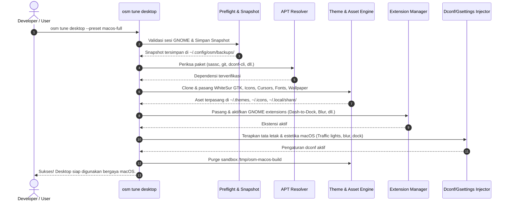

# Spesifikasi Desain: Transformasi Desktop macOS pada Debian 13 (GNOME 48)

**Dokumen ID:** `SPEC-2026-08-22-DEBIAN-13-MACOS-DESKTOP-TRANSFORMATION`  
**Status:** Approved  
**Tanggal:** 2026-08-22  
**Target Platform:** Debian GNU/Linux 13 (Trixie) Bare-Metal (GNOME 48 Wayland/X11)  
**Referensi Video:** Linux Scoop Ver. 3.0 (*"Customize Your GNOME Look Like macOS on Debian 13"*)

---

## 1. Ringkasan Eksekutif & Tujuan Sistem

Dokumen spesifikasi ini mendefinisikan arsitektur, antarmuka CLI, manajemen dependensi, pipeline instalasi tema & ekstensi, serta guardrail keandalan (SRE) untuk modul transformasi desktop **macOS-grade** pada sistem operasi Debian 13 (Trixie) menggunakan suite terintegrasi `osm tune desktop` di repositori `os-manager`.

### Sasaran Utama:
1. **Otomatisasi Penuh (One-Command Deployment):** Mengotomatiskan proses manual instalasi tema GTK, Shell, icon pack, cursor, tipografi Apple SF Pro, dan ekstensi GNOME ke dalam perintah terpadu `osm tune desktop --preset macos-full`.
2. **Reproducibility & Idempotency:** Memastikan instalasi dan konfigurasi dapat dijalankan berulang kali tanpa merusak konfigurasi pengguna atau menghasilkan state ganda.
3. **Safety & Zero-Disruption Rollback:** Menghasilkan snapshot dconf otomatis sebelum mutasi dilakukan dan menyediakan opsi pemulihan instan (`--restore`).
4. **Offline & Sandbox Resilience:** Mengisolasi proses build/ekstraksi ke sandbox `/tmp/osm-macos-build` dengan auto-purge pasca instalasi.

---

## 2. Guardrail Keandalan & Invariant Sistem (SRE Invariants)

* **INV-01 (Zero Data Loss):** Dilarang memodifikasi, menghapus, atau memformat partisi data persisten `/dev/nvme0n1p4` (`/mnt/data`).
* **INV-02 (Strict Idempotency):** Operasi konfigurasi `gsettings`, instalasi aset, dan injeksi bookmark GTK bersifat idempoten.
* **INV-03 (User-Space Isolation):** Aset visual (tema, ikon, font, extension) dipasang pada direktori pengguna (`~/.themes`, `~/.icons`, `~/.local/share/fonts`, `~/.local/share/gnome-shell/extensions`) tanpa membutuhkan hak akses root (`sudo`), kecuali untuk instalasi paket dependensi APT awal.
* **INV-06 (Pre-Run Dconf Snapshot):** Snapshot state `/org/gnome/` selalu disimpan ke `~/.config/osm/backups/desktop-<timestamp>.dconf` sebelum perintah kustomisasi dijalankan.
* **INV-07 (Temporary Sandbox Auto-Purge):** Seluruh repositori git sementara dan build file di `/tmp/osm-macos-build` wajib dibersihkan secara otomatis setelah proses selesai atau ketika terjadi interupsi error.

---

## 3. Arsitektur Antarmuka CLI (`os_manager/commands/tune_macos.py`)

### 3.1 Struktur Perintah & Argumen
Integrasi dilakukan pada modul `os_manager` dengan parameter pendukung pada parser CLI `osm tune desktop`:

```bash
# Transformasi penuh (Tema, Ikon, Kursor, Font, Wallpapers, Ekstensi, Dconf)
osm tune desktop --preset macos-full [--accent blue] [--mode dark]

# Mode inti esensial (Hanya Tema WhiteSur + Dock + Font, tanpa ekstensi berat)
osm tune desktop --preset macos-core

# Kembalikan ke tema standar Debian 13 (Adwaita)
osm tune desktop --preset standard

# Simulasi tanpa eksekusi mutasi (Dry Run)
osm tune desktop --preset macos-full --dry-run

# Pembuatan snapshot dconf manual
osm tune desktop --backup

# Pemulihan desktop dari snapshot dconf
osm tune desktop --restore [path/to/backup.dconf]
```

### 3.2 Diagram Alur Eksekusi (Pipeline Lifecycle)



---

## 4. Komponen Aset Visual & Dependensi

### 4.1 Resolusi Dependensi Paket Sistem (APT)
Daftar paket yang diverifikasi/diinstal via APT:
* `git`, `curl`, `unzip`, `dconf-cli`, `libglib2.0-dev-bin`, `libxml2-utils`
* `sassc` (untuk kompilasi SCSS WhiteSur)
* `gnome-tweaks`, `gnome-shell-extensions`, `gnome-shell-extension-manager`

### 4.2 Repositori Tema Upstream & Parameter Instalasi
| Komponen | Sumber Repositori | Parameter Eksekusi Installer | Target Direktori |
|---|---|---|---|
| **GTK & Shell Theme** | `vinceliuice/WhiteSur-gtk-theme` | `./install.sh -c Dark -t default -N glassy --shell -p 30 -HD` | `~/.themes/WhiteSur-Dark` |
| **Icon Theme** | `vinceliuice/WhiteSur-icon-theme` | `./install.sh -a -t default -b` | `~/.icons/WhiteSur-dark` |
| **Cursor Theme** | `vinceliuice/WhiteSur-cursors` | `./install.sh` | `~/.icons/WhiteSur-cursors` |
| **Typography** | Apple SF Pro Fonts (Display, Text, Mono) | Ekstraksi TTF/OTF & `fc-cache -f ~/.local/share/fonts` | `~/.local/share/fonts/SF-Pro/` |
| **macOS Wallpapers** | Sonoma / Sequoia 4K Dynamic/Static | Salin aset gambar & set gsettings background | `~/.local/share/backgrounds/macos/` |

---

## 5. Orkestrasi GNOME Extensions & Skema Konfigurasi

### 5.1 Matriks Ekstensi GNOME 48
1. **User Themes (`user-theme@gnome-shell-extensions.gcampax.github.com`)**: Mengizinkan pemuatan tema shell WhiteSur kustom.
2. **Dash to Dock (`dash-to-dock@micxgx.gmail.com`)**: Mengubah dash menjadi dock mengambang di bawah layar bergaya macOS dengan auto-hide dan ukuran ikon 48px.
3. **Blur my Shell (`blur-my-shell@aunetx`)**: Efek frosted glass pada top panel, dock, dan overview.
4. **Just Perfection (`just-perfection-desktop@just-perfection`)**: Penyesuaian layout dan perilaku antarmuka GNOME.
5. **Compiz Alike Magic Lamp Effect (`compiz-alike-magic-lamp-effect@hermes8716.github.com`)**: Animasi Genie minimize jendela khas macOS.
6. **Logo Menu / ArcMenu**: Menu tombol logo Apple di sudut kiri atas panel (opsional dalam mode full).

### 5.2 Skema Dconf / Gsettings
```ini
# Window Controls (Traffic Lights on Left)
[org/gnome/desktop/wm/preferences]
button-layout = 'close,minimize,maximize:'
titlebar-font = 'SF Pro Display Bold 10.5'

# Visual Themes & Typography
[org/gnome/desktop/interface]
gtk-theme = 'WhiteSur-Dark'
icon-theme = 'WhiteSur-dark'
cursor-theme = 'WhiteSur-cursors'
font-name = 'SF Pro Text 10.5'
document-font-name = 'SF Pro Text 11'
monospace-font-name = 'SF Mono 10'
color-scheme = 'prefer-dark'

# User Shell Theme
[org/gnome/shell/extensions/user-theme]
name = 'WhiteSur-Dark'

# Dash to Dock (macOS Floating Bottom Dock)
[org/gnome/shell/extensions/dash-to-dock]
dock-position = 'BOTTOM'
extend-height = false
dash-max-icon-size = 48
dock-fixed = false
intellihide = true
custom-theme-shrink = true
background-opacity = 0.25

# Blur my Shell
[org/gnome/shell/extensions/blur-my-shell/panel]
blur = true
brightness = 0.75
sigma = 30
```

---

## 6. Strategi Pengujian & Integrasi Harness

### 6.1 Rencana Unit Testing (`tests/test_tune_macos.py`)
* `test_macos_cli_parser_options()`: Menguji parsing opsi `--preset macos-full`, `--preset macos-core`, `--dry-run`, `--backup`, dan `--restore`.
* `test_dconf_backup_creation_and_discovery()`: Menguji mekanisme penulisan file snapshot dan penemuan snapshot terbaru secara otomatis.
* `test_dry_run_generates_command_plan_without_mutations()`: Memverifikasi bahwa flag `--dry-run` tidak mengeksekusi subprocess mutatif.
* `test_gsettings_batch_application()`: Menguji formulasi tuple schema-key-value untuk konfigurasi desktop macOS.
* `test_restore_engine_with_mock_dconf()`: Menguji eksekusi `dconf load` saat operasi rollback dijalankan.

### 6.2 Integrasi Master Harness
Menambahkan verifikasi modul `test_tune_macos.py` ke dalam `./tests/test_harness.sh` untuk memastikan seluruh rangkaian 60+ assertion lulus 100%.

---

## 7. Penanganan Kesalahan & Pemulihan (Error Handling & Recovery)

1. **Kegagalan Jaringan / Git Clone:** Jika unduhan repositori gagal di tengah jalan, sandbox `/tmp/osm-macos-build` dihapus dan pesan error informatif ditampilkan tanpa mengubah setting dconf.
2. **Ekstensi Tidak Kompatibel:** Jika salah satu ekstensi gagal dimuat, pipeline tetap mengaktifkan tema GTK & dconf dasar dan memberikan peringatan (*warning log*), tidak menghentikan seluruh sistem.
3. **Rollback Instan:** Pengguna dapat kapan saja menjalankan `osm tune desktop --restore` untuk mengembalikan kondisi desktop persis seperti sebelum perintah dijalankan.
