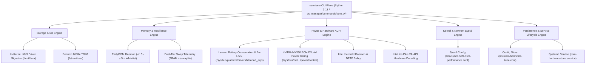

# System Optimization & Resilience Tuning Design Specification

**Status:** APPROVED  
**Date:** 2026-08-22  
**Author:** Lead Systems Tooling Architect & Linux Performance Engineer  
**Target Environment:** Bare-Metal Debian GNU/Linux 13 (Trixie), Linux Kernel 6.12+, Lenovo IdeaPad 3 (81WD) with Intel Core i5-1035G1 (Ice Lake) + NVIDIA GeForce MX330 + 8GB RAM + NVMe SSD  
**Target Plan:** `docs/superpowers/plans/2026-08-22-system-optimization-tuning.md`

---

## 1. Executive Summary & Objective

Building upon the successful Debian 13 (Trixie) bare-metal migration, this specification establishes an automated, idempotent, resilient, and test-driven optimization suite for the host operating system. The goal is to maximize developer ergonomics, thermal efficiency, battery longevity, memory stability, and filesystem throughput.

The optimization suite encompasses five core pillars:
1. **Storage & Filesystem I/O Engine:** Safe migration of the persistent data drive (`/mnt/data` / `/dev/nvme0n1p4`) from CPU-heavy userspace FUSE `ntfs-3g` to the high-performance in-kernel `ntfs3` driver, alongside automated periodic NVMe SSD TRIM (`fstrim.timer`) wear-leveling.
2. **Memory & Resilience Engine:** Automated deployment and configuration of the `earlyoom` daemon (5% RAM / 5% Swap thresholds with session-critical process whitelisting) to eliminate system lockups during heavy memory contention, combined with dual-tier ZRAM (`/dev/zram0`) + physical `/swapfile` health telemetry.
3. **Power, Thermals & Hybrid Graphics Engine:** Lenovo IdeaPad ACPI Battery Conservation Mode (60%–80% charging threshold for battery lifespan protection), Fn-Lock hardware state, Intel `thermald` proactive thermal regulation, and PCIe Runtime D3 Cold (`suspended` 0W idle draw) power gating for the NVIDIA GeForce MX330.
4. **Kernel & Network Sysctl Hardening:** Declarative sysctl tuning (`vm.swappiness=10`, `vm.vfs_cache_pressure=50`, `fs.inotify.max_user_watches=524288`, `vm.dirty_ratio=10`, TCP BBR congestion control with FQ packet scheduling).
5. **CLI Control Plane & Systemd Persistence:** Unified CLI command suite under `osm tune` (`storage`, `memory`, `hardware`, `system`, `all`, `persist`) backed by `/etc/osm/hardware-tune.conf` and `osm-hardware-tune.service`.

---

## 2. Architectural Invariants & Safety Guardrails

| Invariant ID | Name | Architectural Rule |
| :--- | :--- | :--- |
| **INV-01** | **Zero Data Loss on `/mnt/data`** | `/dev/nvme0n1p4` (`/mnt/data`) must NEVER be formatted, wiped, or modified destructively. Any `/etc/fstab` changes must maintain automated timestamped backups (`/etc/fstab.bak.<timestamp>`) and provide instant auto-fallback to `ntfs-3g` if `ntfs3` mount fails. |
| **INV-02** | **Strict Idempotency** | All tuning routines (`tune_system.sh`, `tune_hardware.sh`, `osm tune`) must be safe to execute multiple times consecutively without duplicating configuration directives, restarting healthy services unnecessarily, or causing transient mount drops. |
| **INV-03** | **Privilege Separation & Headless Safety** | Operations altering `/etc/fstab`, sysctl, sysfs, or installing APT packages require root/sudo. CLI commands must auto-detect privilege level, provide clear elevation warnings, and enforce non-interactive execution (`< /dev/null`, `-y -q`). |
| **INV-04** | **Hybrid GPU Decoupling** | The primary display server (Wayland/GNOME) and VA-API hardware video decoding strictly run on the Intel Iris Plus iGPU (`iHD_drv_video.so`). The discrete NVIDIA MX330 dGPU remains in D3cold `suspended` state unless explicit offload rendering is requested. |
| **INV-05** | **EarlyOOM Session Immunity** | The `earlyoom` daemon must strictly protect critical user session and init processes (`systemd`, `sshd`, `Xorg`, `wayland`, `gnome-shell`, `pipewire`, `wireplumber`, `agy`, `claude`) from OOM termination. |

---

## 3. Subsystem Architecture & Technical Specifications



---

### 3.1 Storage & Filesystem I/O Engine

#### 3.1.1 In-Kernel `ntfs3` Driver Migration
* **Problem Statement:** The current mount uses userspace FUSE (`ntfs-3g`), generating high context-switch overhead and CPU utilization during sequential disk I/O on `/mnt/data`.
* **Technical Design:**
  1. Inspect kernel module availability: `modinfo ntfs3` or `/lib/modules/$(uname -r)/kernel/fs/ntfs3/ntfs3.ko.xz`.
  2. Create timestamped backup: `cp /etc/fstab /etc/fstab.bak.$(date +%Y%m%d%H%M%S)`.
  3. Replace `/etc/fstab` line for `/mnt/data`:
     ```fstab
     UUID=6C7AB7E37AB7A7EA  /mnt/data  ntfs3  defaults,uid=1000,gid=1000,umask=022,nofail,iocharset=utf8  0  0
     ```
  4. Perform atomic test remount: `mount -o remount /mnt/data` or `mount -a`.
  5. Verify filesystem type: `findmnt -n -o FSTYPE /mnt/data` must equal `ntfs3`.
  6. **Auto-Rollback:** If mount returns non-zero error, restore `/etc/fstab` from backup and remount with `ntfs-3g`.

#### 3.1.2 Periodic NVMe TRIM
* **Technical Design:** Enable and start `fstrim.timer` via `systemctl enable --now fstrim.timer`.
* **Telemetry:** Audit `systemctl is-active fstrim.timer` and report `fstrim.service` execution status.

---

### 3.2 Memory & Resilience Engine

#### 3.2.1 EarlyOOM Daemon Configuration
* **Package:** `earlyoom` (installed via `apt-get install -y -q earlyoom`).
* **Configuration File:** `/etc/default/earlyoom`
* **Directives:**
  ```bash
  # /etc/default/earlyoom - Managed by os-manager
  EARLYOOM_ARGS="-m 5 -s 5 -r 60 --avoid '(^|/)(init|systemd|sshd|Xorg|wayland|gnome-shell|pipewire|wireplumber|agy|claude)$'"
  ```
  * `-m 5`: Initiates SIGTERM/SIGKILL when available RAM drops below 5%.
  * `-s 5`: Initiates SIGTERM/SIGKILL when available swap drops below 5%.
  * `-r 60`: Sends memory status telemetry to syslog every 60 seconds.
  * `--avoid`: Explicitly protects session-critical desktop, init, audio, and AI agent processes.
* **Service Management:** `systemctl enable --now earlyoom`.

#### 3.2.2 Dual-Tier Swap Telemetry
* **Verification Targets:**
  * Fast Tier: `/dev/zram0` (Compressed RAM, size ~3.8 GB, Priority 100).
  * Storage Tier: `/swapfile` (NVMe ext4, size 8.0 GB, Priority -2).
  * Swappiness: `vm.swappiness = 10`.

---

### 3.3 Power, Thermals & Hybrid Graphics Engine

#### 3.3.1 Lenovo ACPI Conservation Mode & Fn-Lock
* **Sysfs Nodes:**
  * Conservation Mode: `/sys/bus/platform/drivers/ideapad_acpi/VPC2004:00/conservation_mode`
  * Fn-Lock: `/sys/bus/platform/drivers/ideapad_acpi/VPC2004:00/fn_lock`
* **Behavior:**
  * When `conservation_mode=1`, battery charging stops at ~60% to prolong lithium-ion health when connected to AC power.
  * When `fn_lock=1`, top-row keys function as standard F1–F12 by default.

#### 3.3.2 NVIDIA MX330 PCIe Power Gating (Runtime D3 Cold)
* **Sysfs Target:** `/sys/bus/pci/devices/0000:01:00.0/power/control` &rarr; `auto`
* **Validation:** `/sys/bus/pci/devices/0000:01:00.0/power/runtime_status` must evaluate to `suspended` when idle.

#### 3.3.3 Intel Thermald & VA-API Video Acceleration
* **Thermald Daemon:** `systemctl enable --now thermald`.
* **VA-API Driver:** Validate driver initialization via `vainfo` (`Intel iHD driver for Intel(R) Gen Graphics`).

---

### 3.4 Kernel & Network Sysctl Configuration

* **Configuration File:** `/etc/sysctl.d/99-osm-performance.conf`
```ini
# os-manager Debian 13 Performance & Resilience Tuning
vm.swappiness = 10
vm.vfs_cache_pressure = 50
fs.inotify.max_user_watches = 524288
fs.inotify.max_user_instances = 1024
vm.dirty_background_ratio = 5
vm.dirty_ratio = 10
net.core.default_qdisc = fq
net.ipv4.tcp_congestion_control = bbr
```

---

### 3.5 Systemd Boot Persistence Service

* **State Configuration:** `/etc/osm/hardware-tune.conf`
  ```ini
  CONSERVATION_MODE=1
  FN_LOCK=1
  GPU_POWER_SAVE=auto
  ```
* **Systemd Service Unit:** `/etc/systemd/system/osm-hardware-tune.service`
  ```ini
  [Unit]
  Description=os-manager Hardware Power, ACPI & GPU Tuning Persistence
  After=multi-user.target

  [Service]
  Type=oneshot
  ExecStart=/usr/local/bin/osm tune hardware --apply
  RemainAfterExit=yes

  [Install]
  WantedBy=multi-user.target
  ```

---

## 4. CLI Architecture (`osm tune`)

The `osm tune` subcommands will be implemented in `os_manager/commands/tune.py` with the following dispatch hierarchy:

```
osm tune
  ├── system       [--apply | --audit]
  ├── storage      [--apply | --audit]
  ├── memory       [--apply | --audit]
  ├── hardware     [--apply | --audit]
  ├── persist      [--enable | --disable | --status]
  └── all          [--apply | --audit]
```

### 4.1 CLI Output Contract (Human & JSON)
* When called interactively: Formatted colored tables with `[PASS]`, `[WARN]`, `[ERROR]` status badges.
* When called with `--json`: Machine-readable telemetry payload adhering to the schema:
  ```json
  {
    "status": "success",
    "timestamp": "2026-08-22T13:30:00Z",
    "subsystems": {
      "storage": { "ntfs_driver": "ntfs3", "trim_active": true },
      "memory": { "earlyoom_active": true, "zram_active": true, "swapfile_active": true },
      "hardware": { "conservation_mode": "enabled", "gpu_status": "suspended", "thermald_active": true },
      "sysctl": { "swappiness": 10, "tcp_congestion": "bbr", "inotify_watches": 524288 }
    }
  }
  ```

---

## 5. Testing & Verification Strategy

### 5.1 Unit Tests (`tests/test_tune.py`)
1. **CLI Argument Dispatch Tests:** Verify all subcommands parse flags correctly without exceptions.
2. **Mock Sysfs Hardware Tests:** Test reading and writing `conservation_mode`, `fn_lock`, and GPU `power/control` in isolated mock directories.
3. **Mock `/etc/fstab` Transformation Tests:** Verify parser accurately replaces `ntfs-3g` with `ntfs3` while preserving all other mount points and options.
4. **Mock EarlyOOM Configuration Tests:** Verify generation of `/etc/default/earlyoom` with strict `--avoid` patterns.

### 5.2 Live Integration & Audit Verification
* Execute `osm tune all --audit` on bare-metal Debian 13.
* Verify exit code is 0 and all audited subsystems report `PASS`.
* Verify `/mnt/data` is mounted via `ntfs3` and responsive to read/write tests without data loss.

---

## 6. Implementation Plan Reference
Upon review and approval of this design specification, execution will proceed under `docs/superpowers/plans/2026-08-22-system-optimization-tuning.md` utilizing Test-Driven Development (TDD) and Subagent-Driven Development (SDD).
