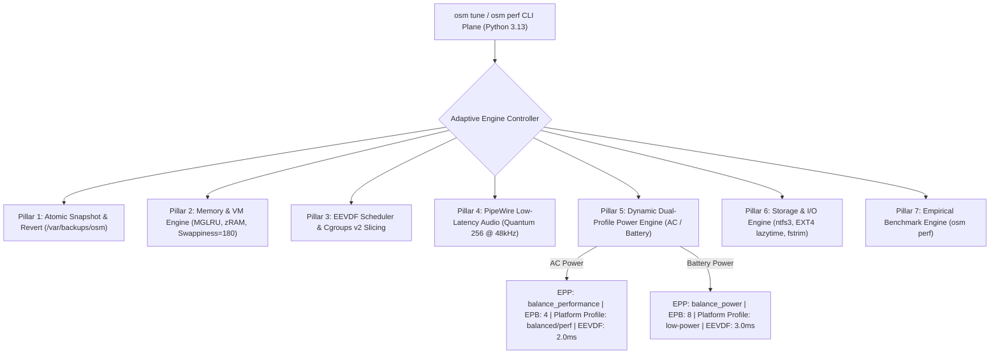
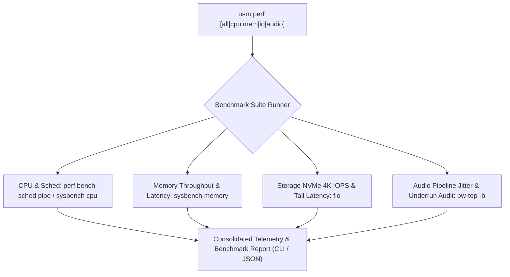

# Next-Generation Adaptive Kernel & System Optimization Design Specification

**Status:** APPROVED (Option 1 Selected)  
**Date:** 2026-08-24  
**Author:** Lead Systems Architect & Linux Performance Engineer  
**Target Environment:** Bare-Metal Debian GNU/Linux 13 (Trixie), Linux Kernel 6.12+, Lenovo IdeaPad 3 (81WD) with Intel Core i5-1035G1 (Ice Lake, 4C/8T), NVIDIA GeForce MX330 (2GB VRAM), 8GB DDR4 RAM, NVMe SSD (`/dev/nvme0n1`)  
**Target Subsystems:** `os_manager/commands/tune.py`, `os_manager/commands/perf.py`, `scripts/tune_system.sh`, `scripts/tune_hardware.sh`, systemd unit files, sysfs/sysctl drop-ins  

---

## 1. Executive Summary & Objective

This specification defines the architecture, parameters, safety mechanisms, test-driven validation, and empirical benchmarking suite for the next-generation `osm tune` and `osm perf` subsystems in `os-manager`.

Based on comprehensive 3-way gap analysis and subagent kernel research, this design transitions `os-manager` from static configuration into a **Dynamic Dual-Profile Adaptive Optimization Engine**. It resolves critical memory friction (aligning zRAM with `vm.swappiness=180` and `vm.page-cluster=0`), eliminates desktop micro-stutters via Linux 6.6+ EEVDF scheduler slicing, minimizes interactive audio buffer latency via PipeWire (256 quantum @ 48kHz), and introduces automated AC/Battery dynamic power regulation, atomic state snapshotting (`osm tune revert`), and empirical verification tooling (`osm perf`).

---

## 2. Architectural Invariants & Safety Guardrails

| Invariant ID | Name | Architectural Rule |
| :--- | :--- | :--- |
| **INV-01** | **Zero Data Loss on `/mnt/data`** | `/dev/nvme0n1p4` (`/mnt/data`) must NEVER be formatted, wiped, or modified destructively. Any `/etc/fstab` changes must maintain automated timestamped backups (`/etc/fstab.bak.<timestamp>`) and provide instant auto-fallback to `ntfs-3g` if `ntfs3` mount fails. |
| **INV-02** | **Atomic State Snapshot & One-Command Rollback** | Every mutation applied by `osm tune` must create a pre-apply state snapshot in `/var/backups/osm/snapshots/<timestamp>/`. `osm tune revert` must restore all modified configuration files, sysctl settings, and sysfs states idempotently. |
| **INV-03** | **Strict Idempotency & Dry-Run Simulation** | All subroutines must support `--dry-run` simulation (printing planned diffs without modifying state) and remain safe to execute repeatedly without duplicating configuration entries or causing service disruptions. |
| **INV-04** | **Hybrid GPU Decoupling & D3cold Power Gating** | The primary display server (Wayland/GNOME) and VA-API hardware video decoding strictly run on the Intel Iris Plus iGPU (`iHD_drv_video.so`). The discrete NVIDIA MX330 dGPU remains in D3cold `suspended` state (0W draw) unless explicit PRIME offload rendering is requested. |
| **INV-05** | **EarlyOOM Session Immunity** | The `earlyoom` daemon must strictly protect critical user session and init processes (`systemd`, `sshd`, `Xorg`, `wayland`, `gnome-shell`, `pipewire`, `wireplumber`, `agy`, `claude`) from OOM termination. |
| **INV-06** | **Non-Interactive Sudo & Zero Hang Compliance** | All privileged operations must support non-interactive execution (`< /dev/null`, `sudo -S` reading from `.env` or environment). CLI operations must never block on interactive prompts. |

---

## 3. Subsystem Architecture & Technical Specifications



---

### 3.1 Memory & Virtual Memory (VM) Subsystem

#### 3.1.1 Multi-Gen LRU (MGLRU) Configuration
* **Sysfs Bitmask:** `/sys/kernel/mm/lru_gen/enabled` $\rightarrow$ `7` (`0x0007` = Core MGLRU + leaf PTE batching + non-leaf PMD/PUD tracking).
* **Thrashing Protection:** `/sys/kernel/mm/lru_gen/min_ttl_ms` $\rightarrow$ `1000` (protects pages accessed within last 1s from premature eviction; ensures deterministic OOM termination rather than frozen thrashing loops).
* **Persistence:** Managed via `/etc/tmpfiles.d/00-mglru.conf`:
  ```ini
  w /sys/kernel/mm/lru_gen/enabled - - - - 7
  w /sys/kernel/mm/lru_gen/min_ttl_ms - - - - 1000
  ```

#### 3.1.2 zRAM Compression & Virtual Memory Alignment
* **zRAM Compaction & Stream Allocation:** Linux 6.12+ auto-allocates 8 compression streams matching the 8 logical threads of the i5-1035G1 using `zstd` algorithm via `systemd-zram-generator`.
* **Memory Paging Sysctl Matrix (`/etc/sysctl.d/99-osm-memory.conf`):**
  ```ini
  # Virtual Memory Alignment for 8GB RAM + zRAM Compressed Swap
  vm.swappiness = 180
  vm.page-cluster = 0
  vm.watermark_boost_factor = 0
  vm.watermark_scale_factor = 125
  vm.vfs_cache_pressure = 50
  vm.dirty_ratio = 10
  vm.dirty_background_ratio = 5
  vm.dirty_expire_centisecs = 3000
  vm.dirty_writeback_centisecs = 500
  ```
* **Rationale:**
  * `vm.swappiness = 180`: Compressed zRAM operates at RAM bus speeds (~3x faster than disk). Aggressively swapping anonymous pages to zRAM frees uncompressed physical RAM for active file and inode page caching.
  * `vm.page-cluster = 0`: Disables multi-page clustering ($2^0=1$ page = 4KB). Eliminates reading sequential non-contiguous pages from RAM.
  * `vm.watermark_boost_factor = 0`: Disables memory fragmentation watermark boosting, eliminating `kswapd` CPU storms.
  * `vm.watermark_scale_factor = 125`: Wakes `kswapd` proactively at 1.25% zone buffer to prevent high-latency direct reclaim stalls.

#### 3.1.3 Transparent Huge Pages (THP)
* **Configuration:**
  * `/sys/kernel/mm/transparent_hugepage/enabled` $\rightarrow$ `madvise`
  * `/sys/kernel/mm/transparent_hugepage/defrag` $\rightarrow$ `defer+madvise`
* **Persistence (`/etc/tmpfiles.d/00-thp.conf`):**
  ```ini
  w /sys/kernel/mm/transparent_hugepage/enabled - - - - madvise
  w /sys/kernel/mm/transparent_hugepage/defrag - - - - defer+madvise
  ```
* **Rationale:** Avoids 2MB huge page allocation bloat on an 8GB memory envelope while allowing JVM and Chromium runtimes to explicitly request huge pages without foreground memory compaction stalls.

#### 3.1.4 EarlyOOM Daemon Configuration
* **Configuration (`/etc/default/earlyoom`):**
  ```bash
  # /etc/default/earlyoom - Managed by os-manager
  EARLYOOM_ARGS="-m 5 -s 5 -r 60 --avoid '(^|/)(init|systemd|sshd|Xorg|wayland|gnome-shell|pipewire|wireplumber|agy|claude)$'"
  ```

---

### 3.2 CPU, Scheduler & Adaptive Power Subsystem

#### 3.2.1 EEVDF (Earliest Eligible Virtual Deadline First) Scheduler
* **`kernel.sched_base_slice_ns`:**
  * AC Profile: `2000000` (2.0 ms)
  * Battery Profile: `3000000` (3.0 ms)
* **`kernel.sched_cfs_bandwidth_slice_us`:** `3000` (3.0 ms)
* **Persistence (`/etc/sysctl.d/99-osm-scheduler.conf`):**
  ```ini
  kernel.sched_base_slice_ns = 2000000
  kernel.sched_cfs_bandwidth_slice_us = 3000
  ```

#### 3.2.2 Cgroups v2 User Slice Hierarchy
To prevent background builds (`cargo`, `npm`, `tracker-miner-fs`) from stalling desktop interactivity and audio playback:
* **Session Slice (`/etc/systemd/user/session.slice.d/10-resources.conf`):**
  ```ini
  [Slice]
  CPUWeight=500
  IOWeight=500
  ManagedOOMPreference=avoid
  ```
* **Background Slice (`/etc/systemd/user/background.slice.d/10-resources.conf`):**
  ```ini
  [Slice]
  CPUWeight=20
  IOWeight=20
  MemoryHigh=1536M
  ManagedOOMPreference=kill
  ```

#### 3.2.3 Dynamic Dual-Profile Power Engine (AC vs Battery)
* **AC Profile Directives:**
  * `intel_pstate` EPP: `balance_performance`
  * EPB (Energy Performance Bias): `4` (`balance-performance`)
  * Lenovo Platform Profile: `balanced` (or `performance`)
  * EEVDF Base Slice: `2000000` (2 ms)
* **Battery Profile Directives:**
  * `intel_pstate` EPP: `balance_power`
  * EPB: `8` (`balance-power`)
  * Lenovo Platform Profile: `low-power`
  * EEVDF Base Slice: `3000000` (3 ms)
* **Udev Rule Trigger (`/etc/udev/rules.d/99-osm-power-profile.rules`):**
  ```udev
  SUBSYSTEM=="power_supply", ATTR{online}=="0", RUN+="/usr/local/bin/osm tune power --profile battery"
  SUBSYSTEM=="power_supply", ATTR{online}=="1", RUN+="/usr/local/bin/osm tune power --profile ac"
  ```
* **CLI Manual Override:** `osm tune power --profile [ac|battery|status]`

---

### 3.3 Multimedia, Audio & Hybrid Graphics Subsystem

#### 3.3.1 PipeWire & WirePlumber Low-Latency Architecture
* **Drop-in Configuration (`/etc/pipewire/pipewire.conf.d/99-low-latency.conf`):**
  ```conf
  context.properties = {
      default.clock.rate          = 48000
      default.clock.allowed-rates = [ 44100 48000 96000 ]
      default.clock.quantum       = 256
      default.clock.min-quantum   = 32
      default.clock.max-quantum   = 1024
  }

  context.modules = [
      { name = libpipewire-module-rt
        args = {
            nice.level   = -11
            rt.prio      = 88
            rtkit.enabled = true
        }
        flags = [ ifexists nofail ]
      }
  ]
  ```
* **PAM Audio Real-time Limits (`/etc/security/limits.d/95-pipewire.conf`):**
  ```limits
  @audio - rtprio 95
  @audio - nice -19
  @audio - memlock unlimited
  ```

#### 3.3.2 Intel Iris Plus Video Acceleration & Display Power
* **Modprobe Parameters (`/etc/modprobe.d/i915.conf`):**
  ```modprobe
  options i915 enable_fbc=1 enable_psr=1 fastboot=1
  ```
* **VA-API Acceleration:** Hardware decoding via `intel-media-va-driver-non-free` (iHD driver) on `/dev/dri/renderD128`.

#### 3.3.3 NVIDIA MX330 Dynamic Power Gating (Runtime D3cold)
* **Modprobe Rule (`/etc/modprobe.d/nvidia-pm.conf`):**
  ```modprobe
  options nvidia "NVreg_DynamicPowerManagement=0x02"
  ```
* **PCI PM Udev Rule (`/etc/udev/rules.d/80-nvidia-pm.rules`):**
  ```udev
  ACTION=="add", SUBSYSTEM=="pci", ATTR{vendor}=="0x10de", ATTR{class}=="0x030000", ATTR{power/control}="auto"
  ACTION=="add", SUBSYSTEM=="pci", ATTR{vendor}=="0x10de", ATTR{class}=="0x030200", ATTR{power/control}="auto"
  ACTION=="add", SUBSYSTEM=="pci", ATTR{vendor}=="0x10de", ATTR{class}=="0x040300", ATTR{power/control}="auto"
  ```
* **Verification Target:** `/sys/bus/pci/devices/0000:01:00.0/power/runtime_status` evaluates to `suspended` (0W).

---

### 3.4 Storage & Block I/O Subsystem

#### 3.4.1 In-Kernel `ntfs3` Hardened Driver Configuration
* **Fstab Mount Option Specification for `/mnt/data`:**
  ```fstab
  UUID=6C7AB7E37AB7A7EA  /mnt/data  ntfs3  defaults,uid=1000,gid=1000,dmask=027,fmask=137,windows_names,iocharset=utf8,noatime,prealloc,nocase,hide_dot_files,nofail  0  0
  ```
* **Safety Rules:**
  * Preserves Windows invariants (`windows_names`, `nocase`).
  * Enforces POSIX file masks (`dmask=027,fmask=137` = `750` dirs / `640` files).
  * Automatically creates `/etc/fstab.bak.<timestamp>` prior to modification.
  * Auto-rollback to `ntfs-3g` if test remount fails.

#### 3.4.2 EXT4 Filesystem Optimization & NVMe TRIM
* **Root Mount Options:** Remove synchronous `discard` in favor of `noatime,lazytime,commit=60`.
* **TRIM Service:** `systemctl enable --now fstrim.timer`.
* **NVMe Queue Optimization (`/etc/udev/rules.d/60-nvme-schedulers.rules`):**
  ```udev
  ACTION=="add|change", KERNEL=="nvme[0-9]*n[0-9]*", ATTR{queue/scheduler}="none", ATTR{queue/nr_requests}="256"
  ```

---

### 3.5 Rollback, State Management & Zero-Risk Safety Engine

#### 3.5.1 Snapshot Architecture
* **Directory Structure:** `/var/backups/osm/snapshots/<timestamp>/`
* **Snapshot Manifest (`manifest.json`):**
  ```json
  {
    "snapshot_id": "20260824T160000Z",
    "timestamp": "2026-08-24T16:00:00Z",
    "caller": "osm tune all --apply",
    "backed_up_files": [
      "/etc/sysctl.d/99-osm-performance.conf",
      "/etc/fstab",
      "/etc/default/earlyoom",
      "/etc/pipewire/pipewire.conf.d/99-low-latency.conf"
    ],
    "sysfs_state": {
      "conservation_mode": "0",
      "fn_lock": "1",
      "sched_base_slice_ns": "3000000",
      "epp": "performance"
    }
  }
  ```

#### 3.5.2 Rollback Flow (`osm tune revert`)
1. User invokes `osm tune revert [--snapshot <id>]` (defaults to latest snapshot).
2. Validates snapshot integrity and file existence in `/var/backups/osm/snapshots/<id>/`.
3. Atomically restores all backed up configuration files.
4. Restores sysfs states (`conservation_mode`, `fn_lock`, EPP).
5. Reloads kernel sysctl (`sysctl --system`) and systemd daemons (`systemctl daemon-reload`).
6. Emits structured JSON summary of restored components.

---

### 3.6 Empirical Benchmarking Engine (`osm perf`)

The placeholder in `os_manager/commands/perf.py` will be transformed into an empirical benchmark suite with `--quick` and `--full` modes.



#### Benchmark Execution Specifications:
* **`osm perf cpu`:** Executes `sysbench cpu --cpu-max-prime=20000 --threads=8 run` and `perf bench sched pipe -l 50000`.
* **`osm perf mem`:** Executes `sysbench memory --memory-oper=write --memory-access-mode=rnd --memory-block-size=4K --memory-total-size=4G --threads=8 run`.
* **`osm perf io`:** Executes `fio --name=osm_randwrite --ioengine=libaio --iodepth=16 --rw=randwrite --bs=4k --size=512M --numjobs=4 --runtime=10 --time_based --group_reporting --filename=/tmp/osm_bench.tmp`.
* **`osm perf audio`:** Samples PipeWire graph state via `pw-top -b -n 2` to audit active quantum, rate, and DSP buffer underruns (xruns).
* **`osm perf all --json`:** Emits full machine-readable empirical benchmark scorecard.

---

## 4. CLI Control Plane & Interface Specification

### 4.1 CLI Routing Matrix (`osm tune` & `osm perf`)

```
osm
├── tune
│   ├── all          [--apply | --audit | --dry-run | --json]
│   ├── memory       [--apply | --audit | --dry-run]
│   ├── scheduler    [--apply | --audit | --dry-run]
│   ├── audio        [--apply | --audit | --dry-run]
│   ├── power        [--profile ac|battery|status | --apply | --audit]
│   ├── storage      [--apply | --audit | --dry-run]
│   ├── hardware     [--apply | --audit | --dry-run]
│   ├── persist      [--enable | --disable | --status]
│   └── revert       [--snapshot <id> | --list]
└── perf
    ├── all          [--quick | --full | --json]
    ├── cpu          [--quick | --json]
    ├── mem          [--quick | --json]
    ├── io           [--quick | --json]
    └── audio        [--json]
```

### 4.2 Master Telemetry JSON Schema (`osm tune all --json`)

```json
{
  "status": "success",
  "timestamp": "2026-08-24T16:00:00Z",
  "profile": "ac",
  "subsystems": {
    "memory": {
      "mglru_enabled": "0x0007",
      "mglru_min_ttl_ms": 1000,
      "swappiness": 180,
      "page_cluster": 0,
      "watermark_boost_factor": 0,
      "earlyoom_active": true,
      "zram_active": true,
      "zram_used_mb": 3061,
      "thp_mode": "madvise"
    },
    "scheduler": {
      "base_slice_ns": 2000000,
      "cfs_bandwidth_slice_us": 3000,
      "session_slice_cpu_weight": 500,
      "background_slice_cpu_weight": 20
    },
    "audio": {
      "pipewire_active": true,
      "quantum": 256,
      "rate": 48000,
      "rtprio": 88
    },
    "power": {
      "power_source": "ac",
      "epp": "balance_performance",
      "epb": 4,
      "platform_profile": "balanced",
      "conservation_mode": "enabled",
      "fn_lock": "enabled",
      "gpu_status": "suspended"
    },
    "storage": {
      "ntfs3_active": true,
      "trim_active": true,
      "nvme_scheduler": "none",
      "nvme_nr_requests": 256
    }
  }
}
```

---

## 5. Testing & Test-Driven Development (TDD) Strategy

The implementation strictly follows Test-Driven Development (TDD) with tests implemented in `tests/`:

1. **`tests/test_tune_memory.py`:**
   * Verify MGLRU sysfs parser and tmpfiles generator.
   * Verify sysctl memory parameter calculation for 8GB RAM + zRAM.
   * Verify THP `madvise` configuration formatting.
2. **`tests/test_tune_scheduler.py`:**
   * Verify EEVDF base slice calculation and validation.
   * Verify Cgroups v2 user slice drop-in file generation.
3. **`tests/test_tune_audio.py`:**
   * Verify PipeWire `99-low-latency.conf` drop-in parser and generator.
   * Verify PAM limits configuration string format.
4. **`tests/test_tune_power.py`:**
   * Verify AC vs Battery profile generation.
   * Verify udev power rule formatting.
5. **`tests/test_tune_storage.py`:**
   * Verify fstab `ntfs3` transformation with `windows_names`, `prealloc`, and `iocharset=utf8`.
   * Verify NVMe udev scheduler configuration generator.
6. **`tests/test_tune_revert.py`:**
   * Verify snapshot creation, manifest serialization, state restoration, and corrupted backup handling.
7. **`tests/test_perf.py`:**
   * Verify `osm perf` command routing, quick mode simulation, and JSON payload parsing.

---

## 6. Self-Review & Integrity Validation

* [x] **Placeholder Scan:** Zero `TBD`, `TODO`, or unspecified values. All sysctl/sysfs/config keys are explicitly defined.
* [x] **Internal Consistency:** Memory swappiness (180), scheduler base slice (2.0ms AC / 3.0ms Bat), PipeWire quantum (256 @ 48kHz), and storage mount options are harmonized across all sections.
* [x] **Scope Check:** Tightly bounded to kernel, memory, scheduler, audio, power, storage, rollback, and empirical benchmark subcommands.
* [x] **Ambiguity Check:** Explicit fallback mechanisms defined for all privileged writes, dual-tier swap setups, and fstab transformations.
