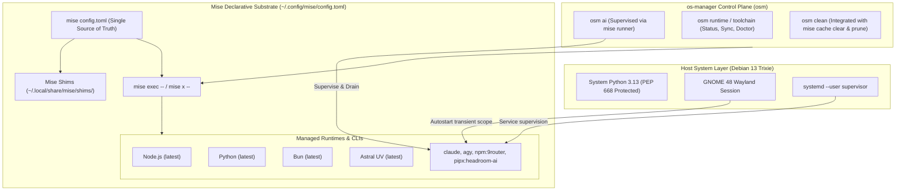
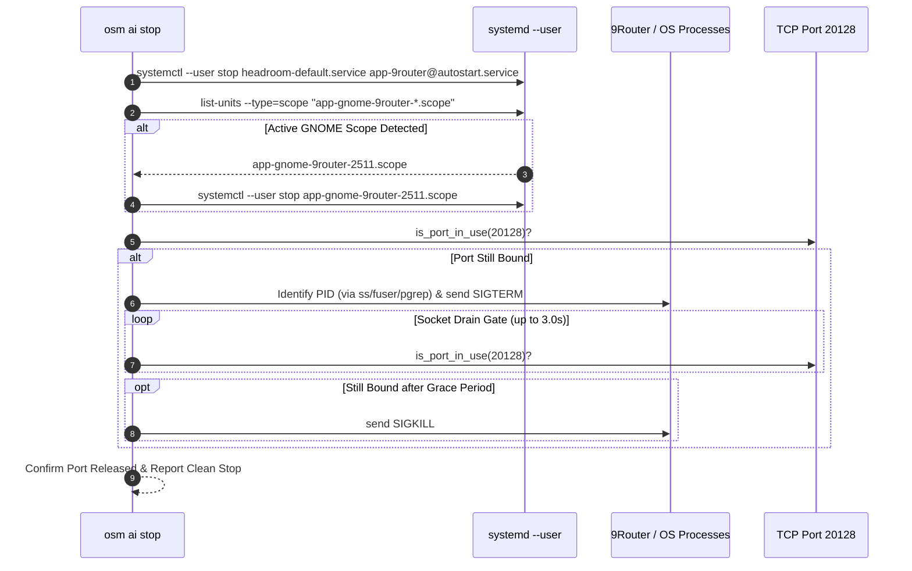

# Mise-Native Declarative Toolchain Architecture and GNOME 48 Wayland 9Router Supervision Specification

- **Author:** Antigravity AI Assistant & osm Core Team
- **Date:** 2026-09-08
- **Status:** APPROVED (Brainstorming Phase Complete)
- **Target Platform:** Debian GNU/Linux 13 (Trixie) 64-bit (Linux 6.12+), GNOME 48 on Wayland, Lenovo IdeaPad 3 15IIL05
- **Decomposition:** 2 Sequential Implementation Rounds (Round 1: Issue Solving; Round 2: Full Architecture Promotion)

---

## 1. Executive Summary

This document specifies the technical design for promoting **`mise`** (`~/.config/mise/config.toml`) into the official user-space declarative toolchain substrate for the `os-manager` (`osm`) platform, alongside harmonizing 9Router process supervision on GNOME 48 Wayland to resolve [GitHub Issue #14](https://github.com/0xrizz/os-manager/issues/14).

### 1.1 Problem Statement
1. **GitHub Issue #14 (9Router Supervision Failure under GNOME 48 Wayland):**
   - In [`os_manager/commands/ai.py`](file:///home/rizz/dev/os-manager/os_manager/commands/ai.py), `osm ai stop` and `osm ai restart` exclusively dispatch `systemctl --user stop app-9router@autostart.service`.
   - Under GNOME 48 on Wayland, desktop autostart applications are executed by `gnome-session-binary` within transient systemd scopes (`app-gnome-9router-<PID>.scope`).
   - Consequently, `osm ai stop` exits silently with success while 9Router remains bound to `0.0.0.0:20128`. Subsequent start attempts cause port collisions (`EADDRINUSE`) or spawn redundant detached processes.
   - Documentation in [`AGENTS.md`](file:///home/rizz/dev/os-manager/AGENTS.md) Pillar VII Section 7.4 erroneously lists port `3000` instead of the active production port `20128`.
2. **Toolchain Fragmentation & Host System Protection:**
   - User-space toolchain management in `osm` is currently fragmented across [`scripts/update_runtimes.sh`](file:///home/rizz/dev/os-manager/scripts/update_runtimes.sh) (NVM, `bun upgrade`, `uv tool`, curl scripts, and `npm -g`).
   - Non-interactive AI agent subshells (Claude Code, Antigravity CLI) frequently encounter missing environment variables or shims.
   - Debian 13 Trixie enforces strict PEP 668 protection on `/usr/bin/python3`, necessitating an airtight user-space runtime manager.

### 1.2 Proposed Solution (Option A: Full First-Class Toolchain Substrate)
Adopt `mise` as the single declarative runtime substrate across `os-manager`, implemented across **two sequential rounds**:
- **Round 1 (Issue #14 Resolution):** Implement mise-aware process supervision, GNOME 48 transient scope teardown, PID termination fallback, and socket drain verification in `osm ai`. Correct `AGENTS.md` and synchronize cross-mount state.
- **Round 2 (Full Architecture Promotion):** Update governance invariants in `AGENTS.md` (Pillar 6.3), refactor maintenance scripts (`update_runtimes.sh`, `clean_system.sh`), and deliver the new first-class `osm runtime` (`osm toolchain`) CLI controller.

---

## 2. System Architecture & Component Model



---

## 3. Detailed Specifications by Round

### 3.1 Round 1: GitHub Issue #14 Resolution

#### 3.1.1 Process Supervision in `os_manager/commands/ai.py`
1. **Runner Resolution Helper:**
   ```python
   def get_mise_cmd(subcommand: str, *args: str) -> list[str]:
       """Resolve mise executable and build deterministic command list."""
       mise_bin = shutil.which("mise") or os.path.expanduser("~/.local/bin/mise")
       if os.path.isfile(mise_bin) and os.access(mise_bin, os.X_OK):
           return [mise_bin, subcommand] + list(args)
       return [subcommand] + list(args)
   ```
2. **Socket Verification Helper:**
   ```python
   def is_port_in_use(port: int, host: str = "127.0.0.1") -> bool:
       """Check if a TCP port is currently open and bound."""
       with socket.socket(socket.AF_INET, socket.SOCK_STREAM) as s:
           s.settimeout(0.5)
           return s.connect_ex((host, port)) == 0
   ```
3. **Harmonized `stop` Workflow:**
   - **Step 1 (Static Systemd Units):** Attempt `systemctl --user stop headroom-default.service app-9router@autostart.service app-9router.service`.
   - **Step 2 (GNOME 48 Transient Scopes):**
     Query active units matching `app-gnome-9router-*.scope` via:
     `systemctl --user list-units --type=scope --state=active --no-legend "app-gnome-9router-*.scope"`
     If found, execute `systemctl --user stop <scope_name>`.
   - **Step 3 (PID Fallback):**
     If port `20128` remains bound, identify PID(s) via `/proc`, `ss -tulpn`, `fuser 20128/tcp`, or `pgrep -f 9router`.
     Send `SIGTERM`, wait up to 2.0s, and escalate to `SIGKILL` if the process persists.
   - **Step 4 (Socket Drain Gate):**
     Poll `is_port_in_use(20128)` every 250ms for up to 3.0s. If the socket fails to drain within 3.0s, emit an explicit warning.
4. **Harmonized `start` Workflow:**
   - **Pre-flight:** Check `is_port_in_use(20128)` and check `check_gateway_health()["router"]["online"]`. If already online and healthy, skip duplicate launch.
   - **Launch Sequence:**
     - Attempt `systemctl --user start app-9router@autostart.service`.
     - If the service unit does not exist or fails, launch via:
       `systemd-run --user --unit=app-9router -- ~/.local/bin/mise exec -- 9router --tray --skip-update`
       (Fallback to `subprocess.Popen` under `mise exec` if the systemd user bus is unreachable).
     - Start Headroom: `systemctl --user start headroom-default.service`.
     - Verify both ports (8787, 20128) achieve online state.
5. **Harmonized `restart` Workflow:**
   - Execute the enhanced `stop` sequence.
   - Wait for the socket drain gate confirmation.
   - Execute the enhanced `start` sequence.

#### 3.1.2 Documentation & Cross-Mount Synchronization
- Modify [`AGENTS.md`](file:///home/rizz/dev/os-manager/AGENTS.md) Pillar VII Section 7.4:
  ```markdown
  * **9Router:** Multi-model proxy routing across cloud and local models (port `20128`).
  * **Headroom:** Context compression and token reducer proxy (port `8787`).
  ```
- Synchronize updated [`AGENTS.md`](file:///home/rizz/dev/os-manager/AGENTS.md) to `/mnt/data/dev/os-manager/AGENTS.md` (Bare-Metal) and `/mnt/d/dev/os-manager/AGENTS.md` (WSL2 if present).

#### 3.1.3 Unit Testing & Test Coverage
- In [`tests/test_ai_command.py`](file:///home/rizz/dev/os-manager/tests/test_ai_command.py):
  - Test `is_port_in_use()` with open vs closed mock sockets.
  - Test `manage_services("stop")` handling GNOME transient scopes.
  - Test `manage_services("stop")` with PID fallback and socket drain timeout.
  - Test `manage_services("start")` with already running gate and `mise exec` launcher fallback.

---

### 3.2 Round 2: Full Mise Architecture Promotion

#### 3.2.1 Governance Standards (`AGENTS.md`)
Add **Pillar VI Section 6.3: Declarative Toolchain & User-Space Substrate (Mise)**:
- Mandate `~/.config/mise/config.toml` as the single declarative source of truth for developer runtimes.
- Prohibit manual runtime version managers (raw NVM scripts, pyenv overrides) and unmanaged global package installations (`npm install -g`, `pip install --user`).
- Ensure all agent subshells utilize `mise exec --` or shims (`~/.local/share/mise/shims`) for CLI tool resolution.

#### 3.2.2 Maintenance Script Modernization
1. **[`scripts/update_runtimes.sh`](file:///home/rizz/dev/os-manager/scripts/update_runtimes.sh):**
   - Remove legacy NVM sourcing and `corepack prepare`.
   - Remove standalone `bun upgrade`.
   - Remove ad-hoc `curl -fsSL ... | bash` pipelines for Claude, Agy, and global npm packages.
   - Standardize update sequence:
     ```bash
     echo "==> Updating system packages (APT)..."
     ./scripts/sudo_exec.sh apt update && ./scripts/sudo_exec.sh apt upgrade -y
     
     echo "==> Updating mise declarative toolchains..."
     mise self-update || true
     mise upgrade
     mise prune -y
     ```
2. **[`scripts/clean_system.sh`](file:///home/rizz/dev/os-manager/scripts/clean_system.sh) & [`os_manager/commands/clean.py`](file:///home/rizz/dev/os-manager/os_manager/commands/clean.py):**
   - Integrate `mise cache clear` and `mise prune` into cache reclamation routines.

#### 3.2.3 First-Class CLI Controller: `osm runtime` (`osm toolchain`)
- Create `os_manager/commands/runtime.py`:
  - **`osm runtime status [--json]`:**
    - Parse `~/.config/mise/config.toml`.
    - Query `mise ls --json` to report installed vs active versions, backend types (`npm`, `pipx`, `core`, `aqua`), and outdated packages.
  - **`osm runtime sync`:**
    - Execute `mise install` to guarantee all declared dependencies are present.
    - Run `mise reshim` to ensure shim symlinks are intact.
  - **`osm runtime doctor`:**
    - Inspect PATH precedence: verify `~/.local/share/mise/shims` precedes system paths.
    - Detect duplicate shadowing binaries in `~/.local/bin/`.
    - Verify Debian system Python (`/usr/bin/python3`) remains intact and unpolluted.
- Register `runtime` subcommand and alias `toolchain` in [`os_manager/cli.py`](file:///home/rizz/dev/os-manager/os_manager/cli.py).

#### 3.2.4 Test Suite & Quality Gates
- Create `tests/test_runtime_command.py` validating `status`, `sync`, and `doctor`.
- Update `tests/test_clean_system.py` and master harness `tests/test_harness.sh`.

---

## 4. Sequence Diagrams

### 4.1 Coordinated 9Router Stop & Drain Gate (Round 1)



---

## 5. Security, Invariants, and Platform Safety

1. **PEP 668 & System Python Protection:**
   - Debian 13 system Python (`/usr/bin/python3`) must never be modified, aliased, or polluted.
   - All Python tools (`headroom-ai`, `graphifyy`) are isolated via `pipx` backed by Astral `uv` under mise.
2. **Zero-Stall Non-Interactive Execution:**
   - All privileged actions (APT updates in `update_runtimes.sh`) must strictly use `./scripts/sudo_exec.sh`.
   - Never execute bare interactive `sudo`.
3. **100% User-Space Execution:**
   - `mise`, `9router`, `headroom`, and coding agents execute entirely under user UID 1000 (`rizz`).
4. **Cross-Mount Data Protection:**
   - Partition `/dev/nvme0n1p4` (`DATA_STORE`, mounted at `/mnt/data`) remains immutable and protected.

---

## 6. Verification and Acceptance Criteria

| Round | Component | Verification Command | Success Criteria |
| :--- | :--- | :--- | :--- |
| **Round 1** | 9Router Stop | `osm ai stop` | Port 20128 freed; transient scope stopped; zero zombie node processes |
| **Round 1** | 9Router Start | `osm ai start` | 9Router online HTTP 200 on :20128 without port collisions |
| **Round 1** | Doc Alignment | `grep 20128 AGENTS.md` | Accurate port 20128; synchronized to `/mnt/data/dev/os-manager/AGENTS.md` |
| **Round 1** | Test Suite | `.venv/bin/pytest tests/test_ai_command.py` | 100% pass across all mocked supervision workflows |
| **Round 2** | Governance | `grep -i "mise" AGENTS.md` | Pillar 6.3 declared and enforced |
| **Round 2** | Runtime Updater | `bash scripts/update_runtimes.sh` | Updates execute via `mise upgrade` without curl piping or NVM errors |
| **Round 2** | Clean Cache | `osm clean --all` | Reclaims storage including `mise cache clear` and `mise prune` |
| **Round 2** | Runtime CLI | `osm runtime status --json` | Valid JSON telemetry of all installed mise tools |
| **Round 2** | Full Test Suite | `bash tests/test_harness.sh` | All assertions pass; zero regressions |

---

## 7. Implementation Handoff & Next Steps

Following approval of this specification, implementation will proceed sequentially via the `writing-plans` skill:
1. **Plan 1 (Round 1):** `docs/superpowers/plans/2026-09-08-round1-issue14-9router-supervision-plan.md`
2. **Plan 2 (Round 2):** `docs/superpowers/plans/2026-09-08-round2-full-mise-architecture-plan.md`
